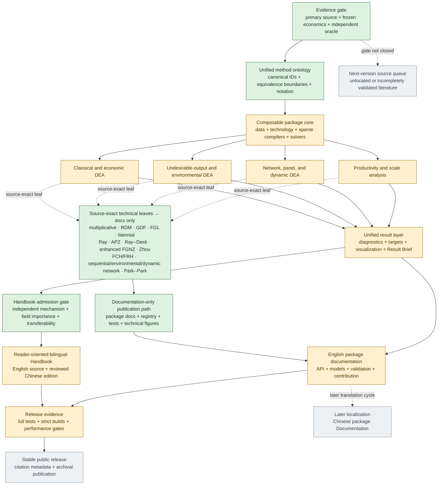

# DEAPack 2.0 roadmap

DEAPack 2.0 is a coordinated software, book, and documentation project for
DEA-based efficiency, productivity, environmental, network, dynamic, and
statistical performance analysis.

The old DEAPack and ProdPack repositories are historical prototypes and data
sources, not architectural constraints. Useful behavior is migrated only
after it fits the new framework and passes theory, numerical, API, and
performance review.

## Shared product contract

- **Package:** composable model families, high-quality results,
  visualization, reporting, diagnostics, and inference.
- **Book:** a reader-oriented theory and practice text organized around
  economic and managerial questions; it uses selected package workflows but
  is not an API manual.
- **Documentation:** complete model/API reference, how-to guides, validation
  notes, visualization gallery, contributor architecture, and migration
  guidance.

Every foundational model-family milestone updates all three products. A
source-exact specialization updates the package, registry, tests, and complete
technical documentation, but enters the handbook only if it passes the
field-level admission gate in `specs/BOOK_ARCHITECTURE.md`:

```text
literature and equivalence audit
            |
            v
normative specification and canonical method ID
            |
            v
compiler / model / operator implementation
            |
            v
independent oracle/certificate + property + failure + performance tests
            |
            v
handbook admission gate: independent mechanism + field-level importance
       | yes                              | no
       v                                  v
book explanation + tested case      package/API documentation only
       |                                  |
       +----------------+-----------------+
                        v
complete model/API/validation documentation
```

English is the canonical editorial source. The rc1 Handbook is rendered in
English and Chinese through the Sphinx/gettext workflow; package Documentation
remains English-only for the first release.

## Current programme map



Green nodes are established shared foundations, source-closed vertical
slices, or governance gates. Source-exact technical leaves--including the
multiplicative, RDM, GDF, FGL, biennial Malmquist, Ray, APZ, Ray--Desli,
enhanced FGNZ, Zhou, FCH/FRH, sequential/environmental-network, and Park--Park
implementations--share one documentation-only publication path. Their code,
oracles, registry records, tests, and technical figures remain release assets,
but none of those paper identities points into the published handbook merely
because its vertical slice is complete. Tone--Tsutsui dynamic network SBM
follows the same technical-publication path: combining the network and dynamic
axes does not by itself create another handbook route. Amber nodes are active, versioned work
streams rather than claims of family completeness. Grey nodes
are deliberately later: publication follows a release-quality evidence pass, Chinese
package-Documentation translation follows rc1, and candidates that fail
the evidence gate remain outside the current public API.

### Verified checkpoint — 3 August 2026

- 65 machine records and 42 typed relation records validate against registry
  release `.56`: 60 public `method_id` records, one public APZ `preset_id`
  record, and four non-public `method_id` prototypes held behind the source
  gate; the 73-entry public catalog contains those 60 methods, five discovery
  specializations, and eight presets;
- the complete Python regression suite passes: 2,657 passed and one optional
  Matplotlib-environment test skipped; deprecated compatibility behavior is
  explicitly tested and captured, with no uncaught warning in the report;
- the scope-corrected 25-source English handbook and the 84-source English
  package documentation both build under fresh, strict Sphinx
  warning-as-error checks; the narrower handbook build publishes 18 chapter
  sources, lists only the 66 works cited by that route, and copies only its 45
  referenced figures, including paired adjacent-period and full-horizon
  Malmquist views, an additive programme-unit Luenberger screen, a certified
  scale-efficiency screen, a classic radial factor/slack-completion ledger,
  the same-plan Additive/RAM/SBM reporting-ruler ledger, the standard
  undesirable-output SBM resource/service/residual account, the ordinary DDF
  same-operation three-programme comparison and its declared-programme/slack-
  completion ledger, and
  the common-factor environmental DDF original-unit programme ledger, the
  three-account weak-disposal technology map, plus
  one adjacent-period environmental ML cross-plant screen,
  generated through existing public plot interfaces, plus one public-result-
  driven opening account that separates technical efficiency, explicitly
  aggregated physical productivity, and observed-price profitability, plus a
  same-hospital study-design account that keeps the candidate roster fixed
  while distinguishing each pre-declared eligible comparison population from
  the active peers selected by the BCC fit; neither account creates another
  plot kind;
  source-specific or evidence-incomplete drafts and technical assets remain
  excluded;
- the English-handbook professional-voice closure now makes the front matter,
  notation, core explanations, and cases lead with economic and managerial
  questions, decision context, interpretation, and limitations. The book
  states result availability in substantive terms, while field-level solver,
  certificate, validity, and release-pipeline details remain in package
  Documentation. Nineteen existing result figures now use reader-facing
  titles, legends, annotations, and qualifications, while their fitted-result
  generators retain the same fail-closed evidence gates and add no solve. The
  pass adds no model or method identity, public API, dataset, chapter, plot
  kind, or handbook route, and left the then-active strict-build scope and
  figure count unchanged; the later Part III closure below records the current
  aggregate;
- a second-round Part I editorial closure now carries one deliberate learning
  sequence across its three foundation chapters: first distinguish the
  technical-efficiency, productivity, profitability/price-recovery, and
  environmental accounts; then define organizational responsibility,
  quantities, eligible comparators, and conclusion boundaries; finally state
  the observed-feasibility, disposal, convexity/FDH, scale-replication, and
  orientation rights that construct the empirical technology. The existing
  hospital and branch cases and six Part I figures remain the teaching
  anchors. The study map and the two densest Part I result figures were also
  simplified and checked at ordinary rendered HTML width; the result figures
  now enforce a 9.5 minimum SVG font-size contract. No model, method identity,
  public API, solve, dataset, figure,
  chapter, plot kind, or route was added;
- a second-round Part II editorial closure now carries one coherent classical
  learning sequence across its five retained mother-family chapters: a
  proportional resource or service commitment; the additional radial gap
  associated with scale and the local scale response; variable-specific
  shortfalls reported through the Additive, RAM, and SBM rulers; a declared
  joint improvement programme under DDF; and cost, revenue, profit,
  allocative, and Nerlovian performance under observed prices. Historical
  aliases and specialized leaves remain consolidated under those transferable
  questions rather than becoming parallel book routes. Symbols, targets,
  score directions, and the book--Documentation boundary are synchronized
  across the chapters, package Documentation, conventions, and teaching
  figures. The scale-efficiency API now preserves a valid numerical CRS/VRS
  ratio for an external reference set but withholds the ordinary
  scale-efficient classification unless the evaluated plan is certified as a
  member of both component technologies. The handbook header and the three
  densest Part II accounts were checked in rendered HTML at ordinary page
  width and revised for legibility. No model, method identity, public API entry
  point, optimization solve, dataset, figure, chapter, plot kind, or route was
  added; the later Part III closure below records the current build aggregate;
- the Part III editorial and release closure keeps only two transferable
  handbook questions: how the production account changes when undesirable
  outcomes are present, and how non-proportional resource, desirable-output,
  and residual gaps enter the standard separable SBM account. The DDF chapter
  teaches common-factor weak disposal and by-production as distinct production
  accounts; the Kuosmanen activity-specific VRS model remains a fully tested
  package-Documentation leaf and appears in the book only to explain why one
  bad-output equality does not identify every weak-disposal technology. The
  generic, common-factor, CFG-preset, and activity-specific DDF contracts now
  separate a certified native distance from membership of an external
  reference technology, count any beta-zero membership task separately from
  zero-solve postsolve certification, and fail closed before publishing the
  bounded efficiency transform or classification. The separable
  undesirable-output SBM now has normalized, row-scaled numerics and
  claim-specific score, target, peer, dual, and membership gates. The
  100-organization checkpoints certify all rows with one reference compilation:
  the activity-specific full account uses its expected 200 primary/completion
  calls in 0.726 seconds, and the separable SBM uses 100 primary calls in 0.342
  seconds; these are development observations, not hardware guarantees. One new
  three-layer weak-disposal map and two redesigned result ledgers pass a
  600-pixel minimum-text contract and direct rendered inspection. The six
  deterministic figure generators are now shared by the local Makefile and
  GitHub Actions. The current English build therefore remains 25 sources and
  18 chapter sources while increasing the active referenced-figure count from
  44 to 45; no model identity, public API entry point, chapter, plot kind, or
  handbook route was added;
- the Milestone 4 closure now fixes one economic and software contract across
  four reader routes: adjacent radial Malmquist (with Global only as its
  reference-information comparison), ordinary additive Luenberger, adjacent
  CFG environmental Malmquist--Luenberger (with Oh GML only as sensitivity),
  and Bjurek Hicks--Moorsteen. Every route declares its change arithmetic,
  neutral value, improvement rule, distance convention, reference-information
  policy, and atomic transition policy. Luenberger, Hicks--Moorsteen,
  CFG/Oh environmental productivity, APZ, and the shared radial-productivity
  kernel now use unit-stable LP rows, independently reconstruct original-unit
  task and decomposition accounts, preserve backend evidence under semantic
  failure, distinguish score from peer disclosure, report actual task and
  solver counts, and add no certificate solve. Cached productivity results
  retain sparse material peers and scalar certificate evidence rather than
  reference-length primal or marginal vectors. The documentation catalog
  exposes machine-readable `publication_scope`: enhanced FGNZ, Ray--Desli,
  Biennial, and APZ remain documentation-only technical leaves. The four Part
  IV cases now use source-qualified public calls, explain changes as operating,
  opportunity, programme-unit, environmental, or quantity accounts rather
  than geometry, and include three redesigned deterministic ledgers whose
  effective text is at least 9.33 pixels in a 600-pixel column. The sealed
  100-unit/four-period gates require 1,200 requested roles and 1,000 unique
  primary calls for adjacent Malmquist, Luenberger, CFG ML, Biennial, and APZ; 800
  unique calls for Global Malmquist and Oh GML; and the Hicks--Moorsteen gate
  requires 800 tasks for 100 adjacent transitions. Fresh warning-as-error
  builds pass with 25 book sources, 45 referenced figures, and 84 package-
  Documentation sources;
- the Milestone 5 current-edition closure now encodes the reader boundary in
  both governance and machine records. The Handbook retains two Network mother
  routes--connected-system feasibility/responsibility and Network-SBM
  variable shortfalls--plus one Dynamic-SBM carry-over route. Ten Network,
  Dynamic, and Panel registry records now require `publication_scope`:
  sequential, environmental-network, accountable-link, ex-post free-
  carry-over, Dynamic-Network, and Park--Park leaves are Documentation-only,
  while source-incomplete general intertemporal and quasi-fixed-capital
  candidates are a non-blocking next-version queue. Network SBM and Dynamic
  SBM no longer compare a legitimate positive Charnes--Cooper scale with the
  residual tolerance. Both retain semantic/backend/raw status, reconstruct
  canonical and original-unit operating accounts, gate targets, links or
  carry-overs, thresholded peers, and finite dual-row reports separately, and
  certify exact zero-extra-solve accounting. A 300-DMU Network-SBM gate
  certified every claim in 2.586 seconds; the four-period Dynamic-SBM
  100-DMU orientations completed in 0.611--0.706 seconds, and its 1,000-DMU
  release gate certified every claim with 1,000 primary calls in 50.875
  seconds. The Documentation-only Dynamic-Network intersection now also uses
  the shared LP and economic gates transactionally, so tampered objectives,
  forged primals, invalid transforms, backend failures, or stale marginals
  cannot leak scores or duals. Its reduction tests remain runtime evidence,
  not a substitute for the missing independent joint oracle;
- the Milestone 6 current-edition closure retains one heterogeneity mother
  route: declared-group O'Donnell--Rao--Battese radial metafrontier analysis.
  Heterogeneity, inference, and uncertainty records now pass the same machine
  publication-scope gate used by productivity and internal-production
  families; no bootstrap, conditional-frontier, second-stage, partial-
  frontier, stochastic, fuzzy, robust, or Bayesian planning name is presented
  as a callable current-edition method. MTR/TGR is machine-labelled
  `higher_is_closer`, and any strictly positive certified group efficiency or
  MTR remains economically meaningful even below a residual tolerance. Group
  and pooled score, completion, target, peer, dual, semantic-status, and raw-
  backend accounts are released independently; generic reports and the
  dedicated decomposition figure use those same gates. Solver counts are
  aggregated from child results and certify zero additional LPs. The classic
  radial base now also turns a backend-optimal but uncertified programme into
  semantic `numerical_error` while retaining the backend claim separately. A
  1,000-DMU/10-group output-VRS gate completed the exact 2,000 primary LPs in
  7.903 seconds with 11 compiled references, all claims certified, maximum
  solver violation $9.369\times10^{-13}$, and identity residual
  $1.110\times10^{-16}$;
- the Milestone 7 current-edition closure adds no planning switchboard and no
  new Handbook chapter. Inverse DEA, centralized resource planning, fixed-
  total/ZSG interdependence, and organizational recombination remain four
  separate next-version mother questions. The current release instead closes
  three presentation questions--performance overview, selected operating
  account, and evidence/audit--plus one bounded deterministic diagnostic.
  `analysis.reference_frequency.selected_plan` counts certified reported peer
  edges strictly above the fitted source `peer_tolerance`, keeps self-use and
  use by other organizations separate, launches no solve, and makes no all-
  optima, global-reference-set, influence, outlier, ranking, or inferential
  claim. Its deterministic 5,000-organization/20-peer checkpoint retained all
  100,000 edges in 0.045 seconds on the development machine. The seven public
  plot kinds now include its selected-plan peer-use view; explicit readability
  gates limit that view to 30 displayed nonzero references, the metafrontier
  view to 60 organizations, a Dynamic-SBM trajectory to 24 periods, and a
  Network-SBM view to 16 processes and 24 link-variable accounts, always
  disclosing omissions or failing closed rather than silently compressing the
  fitted account. The complete audit exporter now uses a trusted internal HTML
  builder, neutralizes formula-like CSV cells and headers, canonically encodes
  structured cells across hash seeds, streams bounded CSV chunks and JSONL
  records directly into an atomic hashed archive, and adds no solve. An
  independent 100,000-row replay verified every CSV/JSONL row and manifest
  hash while reducing traced exporter allocations from about 63 MB in the
  accumulating implementation to about 33 MB. Four formerly static conceptual
  SVGs now have deterministic generators, and the new eight-organization
  reference-frequency case is public-result generated inside the existing
  study-design chapter. Registry release `.56` validates 65 method records and
  42 typed relations; the 73-entry public catalog contains 60 public method
  IDs, five specializations, and eight presets. The full suite passes 2,752
  tests with one environment-conditional skip. Fresh warning-as-error builds
  pass with 25 English-book sources, 18 chapter sources, 124 bibliography
  entries, 46 referenced figures, and 85 English Documentation sources. The
  no-network wheel is 731,671 bytes, contains 128 files (3,637,680
  uncompressed bytes), has SHA-256
  `5fd2b0acbe90e62f8e63a387572f1ad02fbe730d40a6d8700bac69fe48f2d66b`,
  installs into a clean target, and completes both the new reference-frequency
  analysis and audit-bundle export from the installed artifact;
- the current `.54` tree builds a pure-Python
  `deapack-2.0.0.dev0-py3-none-any.whl` with the available local
  setuptools/wheel toolchain and no dependency download. The M6 wheel is
  711,788 bytes (695.1 KiB), contains 125 files (3,558,854 uncompressed
  bytes), and has SHA-256
  `db50ce3f9f30aa822da51b9f8e09e589e9067e68002a81eb709b4aab343f3f8a`,
  installs into a clean temporary target, imports as `DEAPack 2.0.0.dev0`,
  and, from outside the source tree, loads the packaged six-organization
  metafrontier teaching data. The installed artifact reproduces MTR values
  $(0.5,0.5,0.5,1,1,1)$ with all component/decomposition gates valid in 12
  primary calls and zero additional solves. A second installed-wheel smoke
  case preserves a group efficiency of $10^{-7}$, meta efficiency of
  $5\times10^{-8}$, and MTR $0.5$ through both the fitted summary and the
  certificate-gated visualization preparer;
- the 100-DMU, five-process, six-link Network SBM development matrix compiles
  once and solves all 100 evaluations for every applicable orientation and
  link policy; all score, continuity, and accountable-link residuals remain
  below the fail-closed $10^{-7}$ threshold.
- the three classic static SBM orientations, separable strong-disposal
  undesirable-output SBM, Cook general-additive network, Tone--Tsutsui Network
  SBM, and Tone--Tsutsui Dynamic SBM implementations now pass one shared,
  solver-neutral LP certificate plus model-specific operating-account checks.
  Forged or numerically non-finite optimality claims retain the raw solver
  status but release no canonical score or semantic result table; the
  certificate adds no optimization task.
- classic radial DEA now gives its proportional score and optional
  slack-completed operating plan separate solver-neutral LP and economic-
  account certificates. Primary failure withholds all claims; completion
  failure retains only a certified primary score. Publication cleanup is
  checked in unit-scaled accounts, VRS convexity and restricted-RTS duals are
  published only as complete certified accounts, and thresholded peers cannot
  silently change a target. Downstream score, decomposition, target, frontier,
  report, and performance consumers bind to the corresponding phase validity;
  no optimization task or handbook route was added.
- that ordinary radial result now enters the existing result-native
  `improvement` plot through a family-specific ledger. The preparer derives the
  input or output phase-one plan from the certified native factor, then
  reconstructs every final target from its physical and row-scaled completion
  slacks. The exact branch-C case shows $\theta=1$ with no common resource
  saving, followed by a separately certified service gain from 0.5 to 1; it is
  radially efficient and not strongly efficient. Exact method, technology,
  reference, membership, two-phase, and aggregate-account gates fail closed;
  discovery is backend-lazy and preparation adds no solve. The active book
  replaces its abstract O--R--S figure, so no model, method identity, plot kind,
  active figure count, chapter, dataset, variant, or handbook route was added.
- ordinary static DDF now gives its native directional score and optional
  slack-completed plan separate solver-neutral LP and operating-account
  certificates. Primary constraints are row-scaled before optimization;
  cleanup, RTS, thresholded peers, complete duals, and signed negative-distance
  semantics are checked before release. Nerlovian composition consumes the
  explicit DDF score and membership evidence rather than a finite value under
  a bare `optimal` label. The checks remain per observation, add no solve, and
  add no model or handbook route.
- that same ordinary static DDF now opens one certified completed plan through
  the existing result-native `improvement` plot. A family-specific ledger
  keeps the observed quantity, $\beta g$ directional move, declared-programme
  target, optional completion slack, and final target separate in every
  variable's original unit. Exact method/technology/direction metadata, both
  solve certificates, target identities, and aggregate slacks must
  reconstruct, including each published physical/scale/normalized slack
  identity; peer and dual release are intentionally independent because
  neither appears. The documented detached-ledger preparer is new, but no
  existing result/model signature changes. Discovery groups result tables
  once for near $O(NV)$ work, remains backend-lazy, and adds no solve. The
  existing English DDF case
  replaces its scalar ranking figure rather than adding a figure, chapter,
  method, parameter, plot kind, dataset, variant, or reader route.
- the existing environmental DDF kernel now gives primary distances and
  optional slack-completion projections separate fail-closed certificates.
  Phase-one resource, service, and residual rows are unit-stably scaled;
  score release requires LP, raw, and published production accounts, while
  thresholded peers and complete original-unit duals retain independent
  validity. Certification adds no solve. Equality-based external appraisals
  now distinguish a certified directional target from membership of the
  unchanged assessed plan: structural self inclusion and certified negative
  distance are resolved directly, while an otherwise certified nonnegative
  row may require one beta-zero feasibility task before an efficiency transform,
  classification, or improvement display is released.
  Independent dense programmes cover a non-CFG CRS common-factor direction
  and strong disposal under CRS, VRS, NIRS, and NDRS; an exact second-phase
  fixture recovers the residual slack and target. The deprecated
  equality-plus-general-RTS selector is explicitly outside this claim, and no
  model identity or handbook route was added. Cleaned projection accounts and
  thresholded peer displays are certified separately, so a display-only peer
  threshold cannot invalidate an otherwise certified target.
- the named Kuosmanen VRS activity-specific weak-disposal DDF now has the same
  release discipline without being promoted into the handbook route. Its
  phase-one and optional completion programmes use unit-stable quantity rows;
  solver-neutral LP and original-quantity accounts independently gate the
  native distance, target, thresholded activities, and complete original-unit
  duals. External-reference membership uses the same explicit beta-zero rule,
  and a failed membership claim withholds only the bounded display transform
  and efficiency classification. The analytical three-activity oracle remains
  the bounded evidence domain; no claim is transferred to common-factor,
  strong-disposal, temporal, or generalized weak-disposal technologies.
- that same core common-factor environmental DDF now opens one certified
  completed plan through the existing result-native `improvement` plot. A
  separate DDF ledger keeps $\beta g$ and any additional completion slack
  distinct, preserves every variable's original unit, and requires the score,
  both solve certificates, and target account while remaining independent of
  peer and dual disclosure. It reuses fitted result tables and adds no solve.
  Only the family identity and its exact equivalent CFG preset share the
  route; strong disposal, the deprecated equality selector,
  activity-specific weak disposal, by-production, and specializations remain
  excluded. Direction validation preserves the positive-direction invariant,
  uses one merge/pivot per role for mean or custom arrays, and prefilters
  ineligible summary rows before deep reconstruction; ordinary fitted
  directions copy only the selected plan. The existing SBM display also reads
  the canonical registry specialization field. The existing English
  environmental DDF case receives one public-API management figure, with no
  model, parameter, API signature, plot kind, chapter, variant, or handbook
  route added.
- the retained by-production DDF now treats intended production and residual
  generation as two separately certified accounts. Both row-scaled LP/KKT and
  original-quantity reconstructions must pass before their minimum distance or
  directional target is released; thresholded component peers and complete
  original-unit marginals retain independent all-component gates. One failed
  relation cannot leak a partial joint result, and all checks reuse the two
  returned solutions per observation. The English chapter now fixes the
  source output direction and costly-disposal interpretation and describes the
  smaller component only as the direction-specific limiting account. No model,
  parameter, solve, chapter, figure, variant, or reader route was added.
- the retained separable strong-disposal undesirable-output SBM now uses
  normalized Charnes--Cooper slack coordinates and independently row-scaled
  quantity balances. Its score, target, thresholded peers, and complete
  original-unit dual account have separate fail-closed gates; extreme
  independent input, desirable-output, and bad-output rescaling preserves the
  native score and transforms quantities and marginals in their required
  directions. External balance feasibility supplies the model's membership
  certificate, and the combined output account weights the desirable and bad
  subaccount means by their numbers of dimensions. The existing two-plant case
  and `improvement` plot remain the sole handbook route for this family.
- the retained CFG Malmquist--Luenberger and Oh Global
  Malmquist--Luenberger routes now consume that same certified environmental
  distance task. All four source programmes and the complete method-specific
  multiplicative/domain account must pass before a transition releases its
  distances, components, headline, or peers; failure remains local and raw
  diagnostics remain available. The existing APZ package leaf uses a separate
  inequality-and-cap production certificate and remains outside the active
  handbook. No model, parameter, solve, chapter, or plot kind was added.
- the existing adjacent-period CFG Malmquist--Luenberger result now contributes
  one certificate-gated 2020--2021 cross-plant screen through the generic
  `performance` plot. Four publishable transitions reconstruct all four source
  programmes, environmental quantity accounts, and $ML=EC\times TC$; North
  and West remain unavailable under their exact infeasible cross-period roles
  instead of entering the plot as zeros or rankings. The English chapter now
  keeps adjacent-period ML as its sole model line and confines the
  full-horizon GML result to one neighboring reference-information sensitivity
  table. Its former standalone derivation, figure, and circularity tutorial
  were removed. The display reuses fitted tables, adds no solve, and creates no
  model, parameter, API signature, plot kind, chapter, variant, or handbook
  route.
- the generic result-native `performance` view now labels a time transition
  only when the complete selected facet proves one aligned base/comparison
  pair. Non-finite headlines remain unplotted but enter a bounded availability
  ledger that names affected organizations and derives one decisive reason
  from the selected measure's own certification and validity contract;
  duplicate indexes, control characters, long labels, and larger rosters are
  handled without guessing, leaking unbounded text, or adding a coordinate.
  Common-reference Global Malmquist, Biennial Malmquist, and Oh GML discovery
  now shows the source-native best-practice component once. Their explicit
  technical-change compatibility column remains usable under the truthful
  best-practice label, while adjacent-period technical-change components are
  unchanged. Preparation is backend-lazy, $O(N)$ in selected rows, and adds no
  solve, model, parameter, API signature, plot kind, chapter, variant, or
  handbook route.
- the result-native scalar production-frontier view is available for
  certified one-input/one-output CRS and VRS radial fits; it uses public
  target and peer accounts, rejects multidimensional and cross-period
  reconstructions, and generates the English handbook case figure through
  the same tested plotting API.
- the classic Dynamic-SBM result now exposes a certificate-gated carry-over
  trajectory view. The English case uses the public plotting API to separate
  observed, outgoing-target, and next-period inherited quantities, retain the
  native horizon aggregation and source-reconstructed score-inclusion policy,
  and leave the terminal boundary without a fabricated successor. Period and
  horizon performance reconstruct from the published operating accounts. A
  second, theory-led two-period account makes scored good capacity and bad
  backlog reconstructable by hand: Prepared scores one, while Strained has
  $A=0.75$, $B=1.5$, and period and horizon efficiency $0.5$. Its figure
  explicitly keeps the selected backlog path separate from the complete
  period account across all scored dimensions; the bars are not variable
  attribution. The deterministic dataset registry now contains 34 fixtures;
  carry-over targets reconstruct from source slack semantics, while fixed
  commitments retain their no-slack account. This closes only a
  teaching-display debt and adds no model or chapter route.
- the 100-DMU, four-period Dynamic-SBM development benchmark compiles one
  sparse cohort and makes exactly 100 primary solves in each of the input,
  output, and non-oriented VRS base accounts. All 300 results pass both
  postsolve certificates; elapsed times on the checkpoint machine are
  0.535--0.633 seconds per account and the largest reported balance or
  continuity residual is below $6.2\times10^{-14}$.
- the existing classic input-oriented Network-SBM result now exposes a
  certificate-gated process and handoff view. It reconstructs the declared
  process weights and system account, validates independent fitted link
  topology and scale-aware continuity, preserves fixed/free governance, and
  rejects system-radial, relational, additive, output/non-oriented, and
  accountable-link institutions. The English case uses the same public
  plotting API; no model identity or chapter route was added.
- the retained Network DEA system-radial, relational-product, and additive
  process-attribution accounts now expose claim-specific runtime validity for
  their system, process, target/link, and thresholded-peer reports. LP and
  original-quantity economic accounts must certify before release, failures
  remain local to one organization, all primary/secondary/fallback calls are
  explicit, and postsolve checks add no optimization task. One unchanged
  English case compares the three mainstream responsibility institutions
  inside the existing Network chapter; open-DAG and source-parameter detail
  remains in package Documentation.
- the retained Scale family now carries the certified radial projection chain
  into local RTS and scale elasticity. Finite support endpoints require
  LP/KKT/dual and original-unit evidence; an infinite endpoint requires an
  independently verified recession ray; interval, classification, and
  elasticity release atomically. Both orientations retain the exact four-
  solve-per-organization budget with zero certificate solves. The chapter's
  new package-native scale-efficiency view describes an additional radial gap
  and explicitly makes no operating-size recommendation.
- the retained direct Additive and RAM routes now require the shared
  LP/KKT/strong-duality certificate plus raw and published original-unit
  resource, service, RTS, and weighted-slack accounts. Score, target,
  thresholded-peer, and complete dual claims release independently; backend
  status remains auditable, failures remain local, and stable empty schemas
  prevent partial-table leakage. The 100-DMU gate confirms one compilation,
  100 primary LPs, zero secondary/additional/certificate LPs, and 100/100
  certified claims for both routes. Inside the existing slack chapter, one
  generated ledger holds E's VRS peers, original-unit slacks, and targets fixed
  while Additive, RAM, and SBM retain separate native score cards. No model,
  API, parameter, plot kind, variant, chapter, or reader route was added.
- the existing input-, output-, and non-oriented classic static SBM results,
  together with the retained standard separable, strong-disposal
  undesirable-output SBM, now expose one certificate-gated
  variable-improvement view. Tone's five-unit case places resource savings and
  service gains on the focal organization's proportional rulers while
  retaining observed and target quantities in their original units. The
  environmental two-plant case additionally separates residual reduction and
  reconstructs $2/7=(1-1/2)/(1+3/4)$. One-sided orientations label their
  unoptimized side as feasibility-only; exact method, technology, role,
  result-table, summary, and certificate gates reject non-separable,
  weak-disposal, Network, Dynamic, super-efficiency, and paper-specific
  institutions. This closes a teaching-display debt without adding a method
  identity, plot kind, variant, or chapter route.
- the existing core Luenberger implementation now certifies each of its four
  signed directional-distance LPs with the shared solver-neutral primal/dual
  gate and then reconstructs both reference-period changes, $L$, $EC_L$,
  $TC_L$, and $L=EC_L+TC_L$. One failed task or additive account withholds the
  entire transition's distances, peers, components, and headline score while
  preserving raw role diagnostics and leaving other transitions independent.
  The checks add no solve. The exact two-hospital English case uses the
  existing `performance` kind around zero: A reports one and B two absolute
  treatment-batch programme units, explicitly not a productivity ratio. No
  model identity, decomposition, plot kind, variant, or chapter route was
  added.
- the 100-DMU, four-period Luenberger benchmark retains 1,200 requested role
  evaluations but executes exactly 1,000 unique cached distance solves after
  compiling four period references. All 300 transitions pass the four LP and
  additive-account release gates; the checkpoint run completed in 1.734
  seconds and its largest certificate residual was below
  $5.0\times10^{-13}$.
- the existing direct cost, revenue, and maximum-profit models now place one
  solver-neutral LP gate and one reconstructed price-account gate between a
  backend optimum and public economic claims. Scores, targets, thresholded
  peers, and duals have independent validity fields; failures are isolated by
  observation or unique price/reference task, and the certified monetary
  account is published without a second rounding or zeroing pass. The checks
  add no solver calls. In the 100-DMU common-price checkpoint, cost and revenue
  used 100 solves each, their matched decompositions 200 each, and common-price
  VRS profit reused one certified solve for all observations. No model,
  decomposition, figure kind, or handbook route was added.
- the existing core Hicks--Moorsteen implementation now certifies every one
  of its eight distance LPs with the shared solver-neutral primal/dual gate,
  then reconstructs the radial-distance and complete $Q_y$, $Q_x$, and
  $HM=Q_y/Q_x$ accounts. One failed task withholds the entire transition's
  distances, peers, quantity indexes, and headline score while preserving raw
  task diagnostics and leaving other transitions independent. The checks add
  no solve. The English Unit D case now uses the existing `performance` kind
  for a certified headline screen; combined output/input quantity indexes are
  separately plottable only under descriptive no-change-at-one semantics.
  No model identity, decomposition, plot kind, variant, or chapter route was
  added.
- the English Malmquist--Luenberger chapter now begins with two exact
  economic change accounts, maps all four comparison roles to public result
  fields, separates valid negative distances from infeasibility, and keeps
  operating-gap and best-practice-opportunity components explicitly
  noncausal; the matching technical page and deterministic SVG are checked
  against the independent CFG oracle.
- the modified by-production FGL leaf now defaults to the source CRS/CRS
  profile, reproduces the printed DMU 2 and 3 component accounts, checks all
  five source observations with independently compiled scalar programmes,
  and fails closed unless both the cutting-plane interval and the actual
  returned component incumbents pass their numerical certificates. Its former
  independent English chapter and figure are historical development assets
  migrated out of the published handbook; the complete explanation remains
  with the package Documentation, registry, tests, and technical figures.
- ordinary radial phase-one tasks now compile one immutable sparse CSC
  template per unique reference set and bind only observation-specific
  coefficients and right-hand sides. Independent old/new matrix checks cover
  both orientations, all four supported RTS restrictions, global/custom/
  contemporaneous references, structural zeros, and immutability; the public
  model, solver, score, tolerance, and target-completion semantics are
  unchanged.
- the published English learning path now separates the
  production-technology foundation, classical radial DEA, standard FDH, and
  the field-level scale-management questions. The former 1,208-line foundation
  chapter is a 160-line conceptual entry point rather than an API and model
  compendium. The source-qualified FCH and FRH implementations, examples, and
  comparison figures remain package Documentation, registry, and test assets;
  they no longer extend the published-handbook learning path.
- the complete Tone--Tsutsui EBM-I-C manuscript has been frozen and its three
  published examples independently replayed. The source-only certificate also
  proves that a repeated dominant affinity eigenvalue can materially change
  scores, and that one printed hospital projection is infeasible from the
  printed raw table. Because the source supplies neither a general eigenvector
  tie rule nor a deterministic calibration-projection policy, EBM remains
  `deferred_to_next_version` with no production code, registry record, or
  public API.
- the source-qualified Ray--Desli method now retains one CRS Malmquist
  headline while allocating it through four additional VRS tasks. It exposes
  its own `method_id`, native component names, eight-role diagnostics,
  and source-defined partial results under VRS cross-period infeasibility.
  Strictly positive cross-period radial factors are no longer confused with
  the solver tolerance, and cached peer activity is stored sparsely rather
  than as one dense reference-length
  vector per task. The former two-ledger book case and figure are historical
  development assets retained with the package Documentation, registry, and
  tests rather than the published handbook. Multiple-output generalization
  and the Penn World Table 5.6 application remain outside the current evidence
  claim.
- the enhanced FGNZ decomposition now has its own public `method_id` and
  six-task operator: four CRS tasks retain the shared Malmquist headline and
  two own-period VRS tasks allocate efficiency change into `PEFFCH` and FGNZ
  scale change. A production-free exact oracle verifies both nested
  identities and distinguishes the allocation from Ray--Desli. The source
  certificate remains limited to a strictly positive matched panel; tested
  partial-zero and unbalanced-panel behavior is a package extension, and the
  original OECD/PWT5 application remains unreproduced. Any former standalone
  book treatment or decomposition figure for this source leaf is retained as
  a technical Documentation, registry, and test asset rather than a
  published-handbook topic.
- the APZ consistency branch is now public as the canonical preset
  `productivity.malmquist_luenberger.aparicio_pastor_zofio_2013`. It composes
  the 2017 equations (5)--(6) capped-bad-output CRS technology with the
  standard four-distance adjacent ML account, rather than changing CFG
  results after solution. Its source domain keeps inputs and undesirable
  outputs strictly positive, computes a componentwise cap from each reference
  period, and preserves all four contemporaneous own-/cross-period roles. A
  production-free exact compiler derives distances $2/5$, $3/11$, $3/5$,
  and $5/11$, hence $EC=77/80$, $TC=8/7$, and $ML=11/10$, on the 2013 Table 1
  fixture. APZ remains distinct from Oh's own/global GML account, can still
  encounter cross-period infeasibility, and does not claim reproduction of
  the 2017 WIOD application. The shorter `.apz` spelling is discovery only.
  Its source-specific explanatory assets have been migrated out of the
  published handbook and remain in package Documentation, the registry, and
  the test/oracle record.
- the classic multiplicative DEA family is now public as one
  `static.multiplicative` machine method, one shared sparse log-space compiler,
  and two catalog source presets. The 1982 C2S2 log-conic account retains its
  greater-than-one domain and lack of unit invariance; the 1983 free-intercept
  log-convex account retains its strictly positive domain and unit invariance.
  An independent dense source-form oracle checks scores, targets, peers,
  exponent-floor power, and both unit-behavior claims. The synchronized
  package Documentation, deterministic technical figure, registry/test
  evidence, and classical-foundations benchmark close the numerical
  development milestone without claiming a stable or formal release. The
  former independent English book chapter and figure are historical
  development assets and no longer belong to the published handbook.
- Ray's 2008 directional super-efficiency is now public as a fixed VRS,
  observed-bundle, row-level leave-one-out appraisal. Independent dense LPs
  reproduce all ten illustrative `NL` values and all 28 airline `beta`
  values. The public result separates certified ranking value from substantive
  projection validity, so Austrian Airlines' source score above two remains
  auditable while its negative desirable-output boundary is excluded from
  management displays. One compiled sparse base population is reused across
  all focal solves. Its former source-leaf book treatment and figure are
  historical development assets migrated out of the published handbook; the
  technical page, package-native result figure, registry, oracle, and
  visualization validity tests continue to use the same result contract.
- the Zhou--Ang--Wang (2012) non-CHP energy--carbon implementation is public
  as one application-specialization preset with three explicit, required
  accounts and no hidden default. It uses one strictly positive fossil input,
  one electricity output, one CO2 output, the source CRS bad-output equality,
  and one self-inclusive global cross-section. Independent dense programmes
  and exact rational values certify all three accounts; optional optimal-face
  diagnostics expose non-unique component plans and ECPI ranges. The default
  100-DMU integrated-account benchmark compiles one reference set, solves 100
  sparse LPs in about 0.20 seconds, and keeps the largest constraint violation
  near $1.1\times10^{-16}$. Like the other source-exact technical leaves, it is
  absent from published-handbook chapters, cases, figures, and appendices;
  its complete explanation remains in package Documentation, the
  registry, tests, oracle record, and technical figures.
- the handbook now has an explicit admission gate: a topic must add an
  independent, field-level, transferable mechanism and a necessary reusable
  lesson. Paper-specific directions, weights, normalizations, score displays,
  or industry accounts remain in package Documentation even when their code
  and evidence are complete. Appendices apply the same gate rather than acting
  as an overflow method catalogue.
- the admission gate is now explicitly merge-first: the unit of inclusion is
  a core model family, not a named paper. The 18-route contract is unchanged,
  and tests reject paper/year section headings. A congestion heading, if a
  later source-closed teaching treatment needs one, is limited to one unnamed
  section in the existing scale chapter.
- a second core-only content pass keeps those 18 chapter sources but removes
  narrow implementation routes from the teaching path: the environmental
  case now uses the classic CFG DDF, Network SBM teaches fixed and free link
  policies, dynamic--network treatment is only a boundary note, and one
  unified study/model-choice appendix replaces two overlapping maps. The
  activity-specific environmental and accountable-link implementations remain
  fully available in package Documentation.
- separate source protocols now mark both the Färe--Grosskopf--Lovell
  technology comparison and Cooper--Deng--Huang--Li (2002) one-model
  congestion route `deferred_to_next_version`. The accessible evidence
  supports the management distinction but not two complete defining
  programmes and independent published oracles. The identifiers remain
  non-public audit locators and create no registry method, API, executable
  book case, or named handbook model.
- the output-oriented counterpart of the basic Färe--Grosskopf system-radial
  network leaf is now source-closed inside the same public method. The open
  1995/1996 primary paper supplies the two-node CRS technology, output-distance
  definition, and inverse-distance LP; an independent dense compiler and exact
  analytical cases close the numerical claim. VRS is explicitly a composition
  with the separately sourced process-convex technology. No additional book
  route or method identity is created.

### Editorial scope correction

The authoritative mainstream-scope audit is now recorded in
`specs/MAINSTREAM_BOOK_SCOPE_AUDIT.md`. It confirms that the 18 published
chapters cover the first edition's principal model families and authorizes no
new standalone chapter. The congestion concept, defensible value judgements, controllable
variables, statistical credibility, quasi-fixed dynamic mechanisms,
continuous environments, and two productivity interpretation boundaries are
placement tasks inside existing chapters. Cross-/super-efficiency,
Färe--Primont, full inference, conditional frontiers, MPSS, and physical
capacity remain evidence-deferred; named congestion estimators, windows,
decompositions, model-axis
intersections, and application accounts remain technical Documentation.

`specs/CORE_FAMILY_DELIVERY_MATRIX.md` now performs the inverse delivery
audit: it starts from those 18 reader questions and traces each one to its
canonical implementation, independent evidence, technical Documentation, and
teaching practice. It is the authoritative gap queue. Seventeen routes are
closed, conceptually complete, or closed with explicitly bounded validation
debt; the dynamic route is partially closed because the non-SBM
intertemporal and quasi-fixed/adjustment-cost technologies remain behind the
primary-source gate. This finding authorizes work inside the existing dynamic
chapter, not another chapter. Congestion stays a conceptual distinction inside
scale/slack analysis; both named estimator routes are formally deferred;
output-oriented system-radial network DEA has since closed within its existing
family from primary equations and independent numerical evidence. The
Pastor--Lovell global Malmquist debt has likewise closed with a production-free
exact three-period oracle and public-API comparison.

That audit also closed three immediate delivery gaps. Standard FDH now has an
exact finite-activity analytical certificate. The classic CFG DDF certificate
now supports the environmental teaching practice; the independently certified
activity-specific weak-disposal implementation remains a package and
Documentation leaf rather than a handbook route. Additive DEA, RAM, and SBM
now share one exact operating plan in the slack chapter so readers can compare
their treatment of the same physical shortfalls. Catalog evidence labels for
the adjacent Malmquist and Oh GML accounts now agree with their primary-source
records and analytical oracles. None of these changes creates another model
family or handbook route.

The source audit did not guess the two classic non-SBM dynamic routes.
Färe--Grosskopf's defining 1996 dynamic chapter and the Nemoto--Goto 1999/2003
articles could not be obtained at the equation-and-oracle level required for
implementation. Their separate protocols now mark both candidates
`deferred_to_next_version`, list the evidence required to reopen them, and
retain only their economic distinctions inside the existing dynamic chapter.
Narrow accessible capital or investment applications were not promoted to
the umbrella family merely because they expose plausible programmes.

The first source-ready placement pass is now complete without changing that
route. The radial chapter treats extreme endogenous multipliers and defensible
value judgements as qualifications of the parent radial appraisal, not as an
assurance-region or cone-ratio model catalogue. Study design now separates a
precisely solved finite-sample benchmark from influence, sampling, second-stage,
population, and causal claims. Short passages in the dynamic and productivity
parts distinguish carry-over continuity from adjustment-cost dynamics,
organization-level change from industry reallocation, and physical
productivity from profitability and relative-price recovery. These are
interpretation boundaries inside key families; they create no new chapter,
model route, API, or implementation claim. Congestion remains conceptually
distinguished from ordinary scale inefficiency, but its executable estimators
stay evidence-deferred until the source and independent-oracle gates close.

The first editorial pass removes eight independent development pages from the
published-handbook route while preserving their source files and all verified
technical assets: multiplicative efficiency, the range-directional signed-data
leaf, Chavas--Cox generalized distance, the modified by-production FGL leaf,
the biennial Malmquist leaf, Lewis--Sexton sequential network DEA, the
Kalhor--Kazemi Matin environmental network leaf, and Park--Park multiperiod
aggregation. FCH and FRH are likewise removed from the published learning
path, which retains standard FDH; their implementations and complete
explanations remain in package Documentation.

Ordinary cross-efficiency is handled differently: it is a mainstream family,
not a paper-level leaf, but its current chapter is withheld from publication
because the defining-source and independent numerical-oracle gates are not yet
closed. The source draft remains excluded until that evidence is available;
the handbook does not publish a provisional recipe.

The second editorial pass has consolidated the price-based economic pages into
one field-level economic-efficiency route, reorganized the core network pages
around production structure and system/process attribution rather than paper
names, and consolidated the Dynamic SBM material around carry-overs and
trajectory performance. Classic additive DEA and RAM remain in the handbook;
BAM moves to package Documentation as a source-exact but nonessential family
specialization. The productivity route now also treats adjacent-period and
global reference policies within their conventional and environmental parent
families rather than as four separate chapters.

The third pass applies the core-family rule more strictly. FDH now appears
inside classical radial DEA; additive DEA and RAM inside the slack-based
family; and by-production inside environmental technology and DDF. The
paper-level non-separable undesirable-output hybrid, material-balance
specialization, and dynamic-network intersection remain in package
Documentation. Super-efficiency is temporarily withheld with ordinary
cross-efficiency because a verified specialized branch cannot substitute for
an unclosed mainstream defining family. The next source-gated placement queue
contains ordinary cross-efficiency, mainstream radial super-efficiency, weight
restrictions, nondiscretionary and categorical variables, congestion at the
conceptual level,
sensitivity and statistical inference, and operating-environment or
conditional-frontier methods. This is not a future chapter list: each topic
must pass the core-family gate and may belong only as a section or applied-study
safeguard inside an existing chapter after its sources and evidence close.

This is a verified development checkpoint, not a claim that every amber
family in the programme map is complete.

## Current-version evidence gate

An executable literature leaf enters the current release only when three
things are closed together: an original or authoritative defining source is
available, its equations and economic semantics have been frozen, and an
independently reproducible numerical oracle or equivalent exact executable
validation has been completed. A familiar name, a secondary reconstruction,
a plausible LP, or agreement with the production implementation's own output
is not enough.

If any of those items is unavailable, the candidate is recorded as
`deferred_to_next_version`. The current version does not guess the missing
programme, silently borrow a later variant, create a public API, or imply in
the book that the method is executable. Its source protocol states exactly
what is missing and what evidence would reopen the gate in a later version.
Equivalent executable validation means an exact fixture derived independently
from the production implementation, not merely an identity reconstructed
from that implementation's own outputs. Missing source application data
prevents an empirical-reproduction claim, but a future theory release may
still pass with a complete source freeze and an exact independent synthetic
oracle.

The current consistency snapshot has one validated machine record for every
one of the 60 public `method_id` entries, APZ's public `preset_id` record, and
four retained non-public prototype records. The five discovery-only
`specialization_id` entries and the other seven `preset_id` entries remain
catalog identities rather than duplicate machine methods, and all unresolved
literature candidates stay outside the public registry under their
next-version source protocols. `CCRInput`, `CCROutput`, `BCCInput`, and
`BCCOutput` reuse `method_id="static.radial"` while fixing RTS, orientation,
the native score convention, and DEAPack's `compute_slacks=True` row-scaled
lexicographic target policy; the output-oriented CRS FGNZ core preset reuses
`productivity.malmquist.adjacent_geometric`; the two multiplicative source
presets reuse `static.multiplicative` and its one compiler. APZ instead retains
a machine preset record so results can serialize the capped-bad technology and
full source identity without mislabeling it as the CFG operator. The phase-two
radial selector is package policy, not a claim that the foundational papers
uniquely prescribed one alternate radial target.

The public `evaluation.target_completion.pareto_koopmans` identity is an
embedded phase-two protocol rather than an additional machine record or
standalone API. `static.radial`, `static.directional_distance`, and
`static.generalized_distance.chavas_cox` compose its source-checked
Pareto--Koopmans principle and common LP layout on a strictly ordinary convex,
all-discretionary domain. Radial DEA and DDF anchor unit-stable row scales to
the evaluated observation; GDF anchors them to its fixed finite nonnegative
path target. Zero-safe scales permit individual zero coordinates while
observation-level input and output aggregates remain positive. This
difference affects alternate strong-target selection only, not the first-stage
score or strong-status logic. Independent dense $\alpha=0$ three-model
reductions, including a zero-component fixture, plus interior GDF target/unit
checks close the phase-two evidence without claiming an analytical
certificate for GDF's first stage. Environmental, nondiscretionary, FDH, FCH,
and FRH completion extensions remain `deferred_to_next_version`.

Every implemented/public machine record also has a direct execution
benchmark; this closes performance-path coverage without changing any
method's independent-oracle status. The foundational
`static.radial`, `static.directional_distance`, matched
`analysis.scale_efficiency.radial_ratio`, the input- and output-oriented
Tone SBM leaves, the CFG environmental output DDF, and Tone's 2003
non-separable undesirable-output SBM, Coelli's material-inflow account, and
Oh's global Malmquist--Luenberger account
now additionally have
claim-scoped analytical certificates with exact rational fixtures and
independently compiled checks; none is presented as a published-data
reproduction. The separable undesirable-output SBM separately reproduces
only the high-resolution, equal-weight 1:1 branch of Tone's Table 2; its
unequal-weight columns remain outside the claim. The CFG certificate freezes
the fixed-input CRS formulation
supported by the source's output-set definition and its 1995 working-paper
equation, records the inconsistent input term printed in the 1997 journal
equation, and covers both a self-inclusive and a signed old-technology
comparison. Published CFG application data and output tables, published
oriented-SBM numerical oracles, source-qualified standalone NIRS/NDRS
literature leaves, and unique projection claims remain outside these
certificates and are deferred to a later evidence version. NIRS/NDRS remain
tested parameter paths of the shared radial core; no independent
`static.radial.restricted_rts` catalog or machine identity is claimed in this
version.

The Coelli certificate freezes Working Paper 06/2005 equations (23)--(26):
ordinary nonnegative inputs and desirable outputs, one common known
nonnegative physical material-content vector, positive observed inflow, a
fixed desirable-output commitment, and self-inclusive cross-sectional CRS or
VRS envelopment. Its independent compiler recovers exact $TE$, $EE$, $EAE$,
and $EE=TE\times EAE$. EAE needs physical coefficients, not prices.
Material-minimizing peers and targets remain potentially nonunique. NIRS/NDRS,
the source-defined equations (18)--(21) multi-material aggregation until its
independent validation closes, heterogeneous or estimated coefficients,
panel/custom/external source equivalence, the unsupplied unit-level 183-farm
application, and welfare, causal, damage, or actual-emission claims are
`deferred_to_next_version`.

The Oh certificate freezes the CRS common-factor weak-disposal programme,
the observation-scaled $(0,y,b)$ management direction, and one retrospective
pooled CRS conical envelope over a fixed sample vintage. Four self-contained
own-period/global distances are nonnegative by self-inclusion. Exact two- and
three-period accounts close $GML=EC\times BPC$, source-native
$BPG^r=(1+D^r)/(1+D^G)\in(0,1]$, and fixed-vintage circularity without
borrowing the conventional CFG technical-change interpretation. The package
enumerates matched adjacent transitions, while the source ratio itself can
compare any pair within one unchanged vintage. A literal-union estimator,
non-CRS variants, alternate directions or environmental technologies,
arbitrary nonadjacent-result rows, and the unsupplied 26-country application
replay are `deferred_to_next_version`.

Two adjacent evidence expansions are also explicitly parked for the next
version rather than inferred:

- the full dynamic-network SBM mechanism will not receive a broader
  source-closed claim until the terminal carry-over indexing is reconciled
  against a complete primary account and an independent joint
  process-by-period oracle is available; and
- configurable environmental DDF/productivity combinations beyond their
  separately named, source-qualified leaves remain under the environmental
  source protocols until one defining formulation and an independent oracle
  cover every advertised disposal, direction, and reference choice. This
  includes the directional-distance airport branch in Kalhor--Kazemi Matin:
  its input-radial network leaf is closed, but the delegated application data
  for the DDF branch are not, so that branch is
  `deferred_to_next_version`.

Two development-tree reconstructions have now failed the current-version
source gate and are explicitly `deferred_to_next_version`:

- `analysis.capacity.physical.fare_grosskopf_kokkelenberg_1989`;
- `analysis.mpss.banker_1984`.

Each has a defining citation, but the defining full text could not be obtained
for equation-level audit. Their later-source or review-supported
reconstructions and property checks remain useful development evidence, but
they do not substitute for that audit. Both records are therefore
`prototype/none`, absent from the top-level API and public catalog, and
described only by next-version source protocols. Reopening either leaf
requires the defining full text, a frozen source profile, and an independent
oracle.

## Milestone 0 — field map and shared language

Deliverables:

- source-backed DEA method universe;
- nine independently maintainable literature reviews with one evidence schema,
  source/oracle status, and method-to-code/book mapping;
- compositional study framework;
- pairwise equivalence and alias policy;
- canonical method IDs, priorities, status, and validation expectations;
- fail-closed property and compatibility matrix for data domains,
  technologies, measures, targets, operators, and inference;
- normative notation, native-value, score, and decomposition conventions;
- reader-oriented English book architecture;
- package/result/performance architecture.

Exit criteria:

- historically different names are merged only with stated equivalence
  conditions and evidence;
- different technologies, objectives, structures, references, and estimators
  cannot be hidden behind one option;
- every planned entry has a managerial question, canonical composition,
  defining source, dependency tier, and validation plan;
- code, book, and documentation can refer to one canonical method ID.

## Milestone 1 — reusable numerical kernel

Deliverables:

- validated cross-sectional, panel, group, process, link, and carry-over data
  schemas;
- technology, graph, estimator, reference, performance, valuation, evaluation,
  analysis, and uncertainty specifications;
- solver-neutral sparse task representation;
- reusable envelopment and multiplier task compilers;
- SciPy/HiGHS zero-configuration LP backend;
- optional, capability-checked MILP compiler/backend boundary for integer and
  other genuinely discrete technologies;
- a public Green--Cook FCH vertical slice using binary nonempty subsets of
  distinct observed organizations, with componentwise incumbent
  certification, a theory-led five-technology oracle, and no ambiguous `FAH`
  API alias;
- a public whole-template FRH vertical slice using the sparse SciPy/HiGHS
  MILP backend, with finite computational bounds, integer-optimum
  certification, cross-implementation evidence, and no fabricated LP duals;
- compiled-technology caching and batched repeated evaluation;
- lazy immutable row-scale caches: ordinary and absolute maxima compile only
  for consumers that request them and at most once per comparison population
  on the serial path;
- immutable common result schema and model registry metadata;
- legacy adapter boundary;
- unit, property, regression, and performance test infrastructure;
- two-way benchmark governance: every implemented/public method record points
  to a script that directly executes its complete API, and every benchmark
  script resolves back to at least one method record.

Exit criteria:

- pandas work remains at the boundary, not inside per-constraint construction;
- common reference technologies are compiled once and reused;
- repeated observation-level scaling never rescans a compiled sparse
  reference, while models that do not scale rows pay no maxima-reduction cost;
- all statuses, primal/dual residuals, assumptions, reference membership, and
  native values survive fitting;
- deterministic tasks are reproducible and panel matching is identifier
  based;
- benchmark coverage is complete for the public method catalog without
  treating performance scripts as defining literature or independent
  numerical oracles;
- base installation requires no external solver executable.

## Milestone 2 — static black-box production

Core methods:

- radial input/output DEA under CRS, VRS, NIRS, and NDRS;
- multiplier/envelopment dual representations;
- source-qualified production-trade-off restrictions that modify the
  attainable technology;
- standard FDH, source-qualified non-convex FDH scale extrapolation, and
  the completed 1982/1983 multiplicative DEA family, represented by one
  compiler and two source presets;
- additive/weighted additive, RAM/BAM, Russell/ERG, SBM, EBM, DDF,
  the source-qualified VRS range-directional signed-data leaf, hyperbolic,
  subvector, multi-directional, and Hölder-distance measures;
- closest/priority target selection as an evaluation protocol rather than a
  distance alias;
- first-class separation of native measure efficiency, Pareto--Koopmans
  efficiency status, and the guarantee supplied by a target-completion phase;
- efficient-facet/EXFA procedures for strong targets, marginal trade-offs,
  and frontier diagnostics.

The classic direct additive leaf is now source-frozen and independently
certified for Charnes et al. (1985) equations (4.5)--(4.6): VRS, unit weights,
one self-inclusive cross-section, and ordinary nonnegative
inputs/desirable outputs. Fixed positive non-unit weights, CRS/NIRS/NDRS, and
panel/non-global references remain clearly labelled package extensions rather
than borrowing that certificate. Equation (5.7), separately named additive
leaves without obtainable literature, and published numerical reproduction
are `deferred_to_next_version`.

The numerical compiler treats an explicitly declared all-one vector as the
same unit-weight source programme, while preserving its user-declared
provenance. VRS balances are reference-anchored and deviation-scaled before
solving; other RTS paths retain level scaling. This separates solver
conditioning from strong-status scaling, preserves VRS translation and
reciprocal-unit contracts, records effective solver tolerances, and publishes
dual rows only after an optimal solve.

The ordinary Pareto--Koopmans completion phase is now public as an embedded
protocol over radial DEA, nonnegative-policy DDF, and finite-nonnegative-path
CRS/VRS GDF with positive observation-level resource and service aggregates.
It preserves the fitted path before maximizing strictly positive zero-safe
row-scaled slacks and fails closed before reporting generic strong status.
The protocol identity freezes the economic completion principle and LP
layout, while model-specific evaluated-observation versus fixed-path scale
anchors remain disclosed alternate-optimum policies. Environmental,
nondiscretionary, and nonconvex completions stay outside this claim until
their own source equations and exact oracles close.

The standard positive-data input and output Russell names now resolve to the
matched oriented Tone SBM leaves through exact API aliases; graph Russell
remains a distinct planned measure. This closes a historical naming identity
without duplicating a solver or claiming equivalence outside the matched
technology, reference, normalization, score, and target domain.

The 2011 bounded-adjusted measure is now public as `BoundedAdjustedDEA` and
`BAM`. Its first conservative leaf keeps the sample extrema and reference
frontier on one frozen global population, supports CRS/VRS/NIRS/NDRS, and
enforces the source's one-sided slack bounds. A 12-DMU VRS/CRS
cross-implementation oracle, zero-room rules, failure tests, and a dedicated
benchmark gate the implementation. Enhanced BAM, signed-data formulations,
and alternative panel/window/group bound populations remain separate planned
leaves.

BAM's execution form now optimizes bounded normalized slack variables
directly, with reference-anchored VRS or level-scaled other-RTS balances. Extreme
positive unit changes preserve the score and target account, small but
material target contributors remain visible in the peer table, and
non-optimal solves cannot publish dual rows.

The 2004 Portela--Thanassoulis--Simpson range directional measure is now
public as `RangeDirectionalDEA` / `RDM`. It composes the common directional
compiler with a focal-to-coordinatewise-ideal range policy and the source VRS
technology, accepts finite signed inputs and desirable outputs, and reports
native `beta` together with `rdm_efficiency = 1 - beta`. The extrema and
frontier use one exact self-inclusive comparison population. Source
directional targets, phase-one peer activity, and residual slack remain
separate; no hidden Pareto-completion phase converts RDM efficiency one into
a strong-efficiency claim. Translation and positive-unit properties,
orientation-specific all-zero-direction failure, a rational signed-data
oracle, and a dedicated non-strong visualization measure gate the leaf.
IRDM, SORM, RAM, translated radial DEA, and undesirable-output DDF remain
distinct methods.

The Green--Cook free coordination hull is now public as
`FreeCoordinationHullDEA` / `FCH`. It composes a source-qualified radial
measure with a binary, nonempty subset of distinct organizations; every
selected reference can enter at most once. The implementation keeps the
FDH--FCH--FRH inclusion chain, FCH--VRS non-nesting, zero-component
semantics, additive-data requirement, cross-sectional organization identity,
and fail-closed binary/MIP-gap certificate explicit. Its four-organization
dataset supports an independent exact analytical certificate over every
nonempty binary coalition, not a claimed reproduction of Green--Cook's
published empirical table. “Free aggregation
hull” is recorded as an exact historical name, while the ambiguous acronym
`FAH` is withheld because it also denotes Ray's distinct free-affordability
hull.

Operations and value information:

- slacks, peers, targets, multiple optima, scale, RTS, MPSS, scale
  elasticity, and directional scale elasticity;
- cost, revenue, profit, Nerlovian, and supported allocative decompositions;
- profitability/return-to-dollar measures with source-qualified semantics;
- source-qualified short-run physical, utilization, unbiased, and economic
  capacity analyses, kept separate from MPSS and scale efficiency;
- source-qualified congestion analyses;
- economies-of-scope analysis under declared joint- and separate-production
  technologies;
- cross-sectional TFP efficiency with technical, scale, mix, and scale-mix
  components under a declared aggregate-quantity framework;
- AR-I, AR-II cross-side, absolute/relative, cone-ratio, Wong--Beasley
  virtual-share, and value-efficiency valuation leaves, with feasibility and
  implied free-production diagnostics;
- non-discretionary, categorical, ordinal, ratio, integer, zero, and negative
  data formulations, with integer/discrete technologies solved as MILPs
  rather than rounded continuous targets;
- Andersen--Petersen radial super-efficiency remains a tested non-public
  prototype: its defining full text was not obtainable for equation-level
  audit, so orientation/RTS, zero-data, infeasibility, and target claims are
  deferred; Tone super-SBM remains the current public source-qualified
  super-efficiency leaf;
- ordinary CRS cross-efficiency likewise remains a tested non-public
  prototype until the defining Sexton--Silkman--Hogan and Doyle--Green full
  texts and an independent source oracle are frozen; the separate
  Liang--Wu--Cook--Zhu protected--focal game/Nash protocol is public with its
  published score oracle and fixed-point verification; VRS,
  Doyle--Green Method II/III aggressive/benevolent leaves, neutral and other
  ordinary multiplier tie-breaks, common-weight, tier, reference-set,
  frequency, and target-selection protocols remain planned;
- basic and preference-restricted Benefit-of-the-Doubt leaves as a clearly
  labeled non-production extension.

Current implemented economic slice: CRS/VRS cost and revenue with matched
radial allocative decompositions; finite VRS maximum-profit gaps; and the
CCF-1998 Nerlovian DDF decomposition with a public cross-implementation
oracle. The direct cost, revenue, and profit leaves now fail closed unless
their source LP and published monetary account both certify, and their matched
consumers require the direct `score_valid` contract rather than a bare solver
status. The CRS/VRS return-to-dollar leaf is also public, using an exact
extreme-ratio kernel and the fixed Zofío--Prieto oracle. Chavas--Cox GDF is
public for CRS/VRS, and its matched profitability operator reports technical,
scale, and allocative factors with reconstruction checks and separate target
components. Shutdown-enabled profit and the alternative
radial/Russell/additive/SBM/Hölder/modified-DDF/reverse-DDF/general-direct
profit decompositions remain source-qualified roadmap leaves.
The selected-projection Banker--Thrall local-RTS operator is public and
reproduces its five-observation source example, retaining the full normalized
support-intercept interval instead of classifying from one arbitrary dual
optimum. The matched one-sided radial VRS scale-elasticity operator is now
public and reproduces the Førsund--Hjalmarsson seven-unit example without
another solver kernel. The Ren et al. relative-directional VRS leaf is also
public: it validates explicit mean-one resource and service rate scenarios,
reproduces all three published DMU 2 cases, retains zero-rate components
without deleting observations, and reduces exactly to the radial operator for
all-one directions. Other directional scale-response families remain
source-qualified planned analyses. The fixed-observed-mix MPSS and
short-run physical-capacity reconstructions remain tested development
prototypes, but neither is public in this version: their defining full texts
were not available for equation-level audit, so both are
`deferred_to_next_version`. Congestion and all economic, environmental, and
other source-qualified capacity concepts also remain planned.

Study design and deterministic robustness:

- theory-led and source-qualified variable-selection workflows with tuning
  paths and selection-stability records;
- allowable-perturbation, stability-region, and declared model-sensitivity
  analyses;
- machine-checked, fail-closed property compatibility for data domains,
  invariance, monotonicity, targets, and downstream operators.

Exit criteria:

- each canonical entry reproduces at least one published example or trusted
  cross-implementation oracle;
- primal/dual agreement and equivalence relations are tested where applicable;
- unit, translation, monotonicity, orientation, and score-domain properties
  are tested only where theory supports them;
- ranking and target procedures retain secondary-objective and
  multiple-optimum diagnostics.

## Milestone 3 — undesirable outcomes and environmental production

Production accounts:

- legacy transformation/bad-as-input replication with warnings;
- strong, single-factor weak, activity-specific weak, selective disposal, and
  null jointness as independent declarations;
- generalized piecewise weak-disposal and semi-disposal lineages retained as
  research-only until their monotonicity, free portion, and competing source
  formulations are reconciled;
- intended/residual by-production with explicit pollution-generating inputs,
  costly-disposal restrictions, subtechnology intersection, and
  source-qualified coupling or dependence rules;
- factorial/multi-equation production and explicit treatment;
- the source-native CRS/VRS Coelli material-inflow account, with
  multi-material, heterogeneous-coefficient, panel/external, and empirical
  reproduction claims deferred, plus distinct weak-$G$ conservation and
  material-flow systems;
- separately identified natural and managerial disposability strategies.

Measures and analyses:

- environmental DDF;
- separable and non-separable undesirable SBM;
- directional SBM/Russell/non-radial measures;
- environmental hyperbolic measures and separately source-qualified
  non-oriented graph measures;
- by-production DDF and FGL-style measures;
- environmental economic objectives, pollutant shadow-price intervals, and
  marginal abatement-cost analysis.

The conventional BP-DDF is now source-frozen at Murty--Russell--Levkoff's
CRS, fixed-direction, self-inclusive cross-sectional profile. The packaged
five-DMU example reproduces equation (5.6) for DMUs 1--3, and an independently
compiled dense programme closes both component distances and their minimum
for all five observations. The source uses BP-DDF to diagnose weak indication
and direction sensitivity; its proposed response is the distinct FGL index.
VRS/NIRS/NDRS, observation-varying directions, temporal/non-global
references, abatement outputs, and coupled subtechnologies remain explicitly
outside the certificate.

The current public vertical slice now includes both the separable
strong-balance undesirable-output SBM and Tone's 2003 non-separable hybrid.
In the latter, inputs are never partitioned: selected good and bad outputs
share the retained operating proportion `alpha`, while inputs and the
remaining outputs retain variable-specific slack accounts. The source
projection `alpha * observed` remains distinct from reference activity and
from any unscored residual between the two. This is a measure and target
contract, not a weak-disposal axiom. The VRS Table 4 fixture at
`alpha_min=0.7` has an independent analytical certificate and matches every
Table 5 projection and `alpha`; the source's inconsistent printed score cells
are disclosed rather than repaired. CRS/NIRS fits also reject the
`alpha_min=0` all-non-separable case when it would admit an unanchored
zero-activity shutdown.

The public slice also includes Kalhor--Kazemi Matin's corrected
activity-specific weak-disposal technology for a general process network.
Its economic accounts distinguish external inputs, ordinary intermediates,
and final/internal desirable and undesirable products. One sparse
input-radial programme returns a system factor \(h\), process-specific
\(\alpha/\beta\) plans, and coordinated account targets under
CRS/VRS/NIRS/NDRS; it does not manufacture process efficiencies or a strong
slack certificate. Independent dense compilation reproduces both published
examples, including the three-unit VRS target and the four-process CRS
scores.

Exit criteria:

- results state the production account, pollutant-level disposability,
  null-jointness status, direction, and abatement data;
- weak disposal is never represented as one unexplained hard-coded equation;
- alternative production accounts can be compared in a common sensitivity
  report without being presented as equivalent;
- model-derived trade-offs are not labeled market prices or social damages.

## Milestone 4 — productivity and change

Handbook-core closure is deliberately narrower than the package universe. It
contains exactly four reader-facing routes:

- the ordinary radial Malmquist family, taught through the adjacent geometric
  account; full-sample Global Malmquist is retained in that same family only
  as a supporting reference-information policy comparison, not as another
  primary model;
- the ordinary additive Luenberger productivity indicator;
- environmental productivity through the adjacent Chung--Färe--Grosskopf
  Malmquist--Luenberger account; Oh's full-sample GML account appears only as
  a bounded reference-information sensitivity check; and
- the Bjurek Hicks--Moorsteen adjacent-period output/input quantity account,
  with its eight distance roles and complete quantity-index reconstruction.

The broader package and technical Documentation retain a larger reproducible
method universe without enlarging the handbook core:

- the independently implemented enhanced FGNZ and Ray--Desli decompositions,
  Biennial Malmquist reference policy, and APZ environmental technology preset
  are documentation-only release assets;
- the two-component output-CRS FGNZ identity is the source-qualified account
  inside the adjacent Malmquist route, not a fifth reader route;
- sequential, window, and other sampling policies remain study-design or
  technical-reference material unless paired with a source-closed core
  economic account; rolling-window efficiency remains repeated static
  appraisal rather than a productivity index; and
- quasi/generalized and non-radial SBM productivity, Luenberger--Hicks--
  Moorsteen, Färe--Primont, cost/profitability and price--quantity change,
  Kumar--Russell growth accounting, meta-frontier change, aggregation and
  reallocation decompositions, environmental combinations, and other
  paper-specific or incompletely source-closed candidates are next-version
  work. Missing literature or an open independent-oracle gate cannot be
  inferred away and does not block closure of the four handbook routes.

Handbook-core closure and broader package expansion are therefore separate
gates. A public API, complete implementation, or registry record is not by
itself authority for a book chapter, appendix, case, or figure.

Exit criteria:

- identifier, unbalanced-panel, period-order, and benchmark-vintage policies
  are explicit;
- cross-technology infeasibility and historical revision are visible;
- multiplicative indexes use `> 1` and additive indicators use `> 0` for
  improvement;
- every named decomposition reconstructs its aggregate under tested
  conditions;
- directional components are combined only when their units are comparable;
- benchmark-based accounting components are not given causal labels; and
- every productivity method record declares its machine-readable publication
  scope, and supporting or sensitivity placements cannot be reported as
  primary handbook families.

## Milestone 5 — internal and intertemporal production

Delivered package vertical slices; technical delivery does not by itself create
a Handbook route:

- immutable graph declarations and single-storage network observations;
- the Färe--Grosskopf two-stage intermediate-products system-radial leaf under
  input and output orientation, CRS, and the separately sourced
  Podinovski--Bouzdine-Chameeva VRS convexification, with process-specific
  intensities, disposable link surplus, one orientation-qualified certified
  system score, and no stage-efficiency claim;
- a conditional CRS identity test against the independently compiled
  Kao--Hwang primary system programme, recorded as score duality rather than a
  whole-method alias on the input-CRS branch; the output branch instead has an
  independent dense source-equation compiler and exact analytical cases;
- the Documentation-only Kalhor--Kazemi Matin environmental general-network
  input-radial leaf,
  with explicit environmental product accounts, activity-specific
  \(\alpha/\beta\) weak disposal, producer-specific intermediate balances,
  cycles and internal good/bad flows, process-wise CRS/VRS/NIRS/NDRS
  restrictions, and independently reproduced Tables 1--4;
- the CRS Kao--Hwang relational two-stage preset with source-qualified stage
  attribution and optional attribution bounds;
- shared intermediate multipliers, process-specific intensities, Lim--Zhu
  link-feasible targets, the published 24-insurer oracle, and a sparse
  performance benchmark;
- the Chen--Cook--Li--Zhu additive two-stage preset under CRS and VRS, with
  endogenous virtual-resource shares, source-qualified stage priorities,
  process intercepts, weighted-additive reconstruction, and distinct
  upstream/downstream intermediate targets;
- the complete 24-insurer Lim--Zhu score and projection oracle, including an
  explicit record of the corrected 2019 value where the 2009 source table
  differs, plus a sparse benchmark with one compiled global reference set.
- a measure-neutral compiled DAG layout with deterministic process/link
  incidence for open series, branching, and skip-link networks;
- the CRS Cook--Zhu--Bi--Yang general additive preset, including external
  resources and services at intermediate processes, shared link valuations,
  endogenous process-input shares, and reproduced Tables 2, 3, and 7;
- an explicit boundary for the Cook additive leaf: general-network VRS,
  cycles, shared pools, transformed links, and projections are not inherited
  from other network methods and remain unavailable there until separately
  audited;
- the Tone--Tsutsui network SBM over connected general networks, with
  division-specific intensities, fixed/free handoff continuity, CRS/VRS,
  three source orientations, sparse compile-once execution, and reproduced
  source VRS/CRS oracles;
- the Documentation-only Lewis--Sexton sequential forward-quantity radial
  procedure over
  acyclic networks, with process-specific standard RTS, initial and propagated
  process accounts, source min/max organizational aggregation, the defining
  two-organization oracle, and an explicit boundary excluding reverse
  quantities, mixed accounts, and site-characteristic adjustments;
- the Documentation-only Park--Park two-phase multi-period aggregative radial
  procedure, with one common factor across separate contemporaneous period
  technologies, source VRS/CRS construction, balanced-panel validation, the published
  full/weak/inefficient oracle, and an explicit boundary excluding state
  transitions, time preferences, and productivity interpretation;
- Tone's source-qualified super-SBM protocol, with same-RTS ordinary-SBM
  strong-efficiency screening, CRS non-oriented/input/output programmes, the
  source non-oriented VRS programme, published Table 1 and power-plant
  oracles, explicit peer-replacement accounts, and fail-closed rejection of
  automatic zero, signed, undesirable-output, and unsupported-RTS variants;
- the Documentation-only Tone--Tsutsui dynamic-network SBM process-by-period
  system, preserving all four source link roles, typed carry-overs,
  division-specific CRS/VRS, explicit terminal-boundary resolution, sparse
  compile-once execution, and atomic LP/economic certification. Its reduction
  and synthetic-property tests do not close the pending independent joint
  process-by-period oracle.

The remaining candidates below may extend this tested foundation in later
versions. They are neither current-edition Handbook routes nor blockers for
closing the M5 core; every item must independently pass the source and oracle
gates before it becomes an implementation deliverable.

Broader Network package queue:

- source-qualified cyclic, shared-pool, transformed-link, and other general
  directed graph formulations for measures whose current leaves do not admit
  them; support in one environmental or network-SBM leaf is not inherited by
  unrelated models;
- source-qualified bounded, transformed, or other link-control policies beyond
  the fixed/free handoff cases already implemented for Network SBM;
- shared resources and exogenous later-stage inputs;
- partial input--output incidence and resource-sharing matrices;
- common versus node-specific intensities and node-specific RTS;
- additional source-qualified directional, economic, and general-network
  measures beyond the implemented radial, relational, additive, and Network-SBM
  leaves;
- source-qualified network scale/RTS and productivity operators;
- broader Färe--Grosskopf fixed-factor-allocation, dynamic, and other
  source-qualified network constructions beyond the implemented basic
  intermediate-products radial leaf, plus extensions beyond the implemented
  Tone--Tsutsui, Kao--Hwang, Chen-et-al., and Cook-et-al. leaves;
- source-qualified network scale/RTS and productivity leaves; generic
  network analysis names remain non-executable umbrellas;
- cooperative, centralized, leader--follower, and bargaining governance;
- additional undesirable-intermediate and final-output technologies and
  measures beyond the implemented Kalhor--Kazemi Matin environmental radial
  account.

Current-edition Dynamic publication closure:

- **Handbook core:** the implemented Tone--Tsutsui dynamic SBM with complete
  trajectories, desirable, undesirable, free, and fixed carry-overs, CRS/VRS,
  three source orientations, period/input/output importance weights, base
  trajectory and period accounts, published oracle, and sparse compile-once
  execution;
- **Documentation-only sensitivity:** the selected-solution ex-post
  free-carry-over adjustment, which does not create another Dynamic-SBM route;
- **Documentation-only intersection:** the implemented Tone--Tsutsui
  dynamic-network intersection: process-by-period technologies, within-period
  link continuity, typed intertemporal carry-overs, mixed division-level
  CRS/VRS, explicit
  terminal-index policy, and fail-closed system/period/process performance
  accounts; broader source-closed claims remain gated by the independent joint
  oracle described above.

Next-version Dynamic source queue:

- Färe--Grosskopf intertemporal production/network technologies with explicit
  temporal links;
- Nemoto--Goto investment technologies with quasi-fixed capital, adjustment
  costs, and intertemporal substitution;
- the remaining Tone--Tsutsui extensions: source-qualified initial condition,
  shared current-output/future-capacity resource, alternate-optimum period
  ranges, and a true MILP free-carry-over score with certified bounds;
- general transition technologies with explicit lag, decay, and terminal
  policies, which are not inferred from historical carry-over labels;
- additional dynamic-network efficiency measures and productivity operators
  that retain process, state, and transition accounting;
- named dynamic-efficiency and dynamic-productivity identities with
  system/period reconstruction tests; generic dynamic analysis names remain
  non-executable umbrellas;
- information and discounting policies for intertemporal economic models.

Current-edition exit criteria, satisfied by the current public core and technical
vertical slices:

- all system, process, link, and carry-over targets satisfy the same network
  accounting constraints;
- independent stage scoring is never labeled network DEA;
- window/productivity analysis is never labeled dynamic production;
- system/component reconstruction is claimed only for models that prove it;
- sparse-network performance scales with graph structure rather than dense
  Cartesian expansion.

## Milestone 6 — fair comparison, inference, and uncertainty

### Current-edition Handbook and public core — frozen

The O'Donnell--Rao--Battese radial group/metafrontier account is the **sole
Milestone 6 Handbook route** in the current English edition. Its public
`RadialMetafrontierDEA` operator supports matched CRS/VRS and input/output
programmes, ex ante group membership, pooled convex/conic construction,
nestedness certification, and the
group-efficiency--MTR--meta-efficiency identity. `reference.group` and
`technology.meta.pooled_convex` describe components used inside that composed
operator; neither is a standalone public constructor or fitted method.

The implementation uses a six-organization, two-declared-group analytic oracle
and an independent source-equation LP compiler for all four orientation/RTS
profiles. It keeps group and pooled solver accounts separate, labels pooled VRS
peers as potentially virtual cross-group combinations, and uses one all-period
pooled technology at both levels for panel data. MTR/TGR is an
opportunity-proximity account, not a causal environmental effect. The dedicated
certificate-gated result plot joins group and pooled efficiency and labels
their MTR for the same account; it does not create another model or Handbook
route. The original 97-country FAO observation panel has not been recovered,
so the package implements the published equations without claiming
reproduction of that application.

Known groups are supplied before estimation. This route does not discover
clusters, estimate latent classes, or condition a frontier continuously on
operating circumstances. Non-radial, nonconvex, environmental, conditional,
latent-group, and productivity metafrontiers therefore remain distinct
next-version candidates rather than options on the current operator.

Statistical foundations and second-stage cautions remain conceptual safeguards
inside the current book, not an implied package capability. The present public
catalog exposes no bootstrap, partial/conditional-frontier, contextual
second-stage, stochastic/robust-data, fuzzy, or Bayesian inferential procedure.

Current-edition exit criteria, satisfied by this frozen slice:

- one matched radial definition governs both group and pooled comparisons;
- declared groups, pooled construction, temporal information, and
  cross-group peer provenance remain explicit;
- component scores and the MTR identity fail closed under numerical or
  economic-account failure;
- the MTR is described as proximity to represented broader opportunities, not
  managerial quality or causal attribution; and
- no planning name in the statistical review is documented as a callable API,
  a completed implementation, or an additional Handbook route.

### Next-version source-gated queue

The remaining Milestone 6 subjects are a non-blocking next-version queue. A
procedure can leave this queue only after **all three** of the following are
present: a source protocol freezing its estimator, DGP, and permitted claim; an
independent numerical oracle; and a typed result/failure contract. A DOI,
literature-review card, familiar acronym, or working base DEA solver does not
satisfy those gates.

Heterogeneity and operating conditions:

- non-radial and nonconvex metafrontiers and non-homogeneous-DMU technologies
  for structural factor absence or specialization, distinct from missing-data
  repair;
- explicit separability tests before choosing a second-stage or conditional
  frontier design;
- separately validated Simar--Wilson 2007 Algorithm 1 and Algorithm 2
  procedures, never one generic second-stage toggle;
- the assumption-specific Banker--Natarajan contextual OLS lineage, never a
  license for naive OLS on arbitrary DEA scores;
- conditional DEA/FDH with a complete bandwidth and support policy; and
- Fried's DEA--SFA--DEA three-stage adjustment under its distributional and
  data-adjustment assumptions.

Diagnostics and sampling:

- dominance, dimensionality, influence, reference-frequency, leave-one-out,
  outlier-audit, degeneracy, and multiple-optimum diagnostics;
- source-qualified static-frontier and productivity bootstrap procedures and
  tests of RTS, convexity, and technology equality;
- estimator-specific mean-efficiency and productivity CLTs;
- separately named measure-, dimension-, sampling-, and dependence-compatible
  subsampling leaves; there is no generic executable `inference.subsampling`;
- order-$m$ and order-$\alpha$ partial frontiers, including explicitly
  conditional compositions where theory supports them; and
- source-qualified directional-distance inference distinct from radial
  frontier bootstrap procedures.

Data and decision uncertainty:

- interval/IDEA and fuzzy formulations;
- separate stochastic leaves for random frontier deviations, measurement
  error, stochastic production-possibility sets, and chance-constrained
  feasibility;
- box/polyhedral/budgeted robust LP formulations;
- optional conic and distributionally robust backends; and
- experimental Bayesian DEA with explicit likelihood, prior, posterior, and
  validation semantics.

Future exit criteria retain the following prohibitions: naive row bootstrap
and naive OLS/Tobit score regressions are not defaults; inference compatibility
must be established for each base estimator and measure; contextual
association is not a causal effect; outlier tools never silently delete
observations; and probability, confidence, interval, fuzzy, robust, and
posterior statements remain terminologically and numerically distinct.

## Milestone 7 — decision support, visualization, and reporting

Current-edition boundary:

- this milestone closes trustworthy visualization/reporting and only those
  descriptive diagnostics that can be derived from certified public-result
  evidence without refitting, deleting observations, or making inferential,
  causal, or prescriptive claims;
- it introduces no decision-support API and no decision-support Handbook
  chapter in the current edition; and
- every prescriptive procedure remains evidence-gated `next_version` scope.

Four managerial mother questions organize that later decision-support work:

1. **Maintained-performance planning / inverse DEA:** which selected
   quantities may change while a declared base-performance condition is
   retained?
2. **Centralized resource planning:** how should an authorized organization
   allocate controllable resources or commitments under an explicit system
   objective and conservation account?
3. **Fixed-total interdependence / ZSG:** how does one unit's proposed gain
   change the jointly feasible allocations of all other units when a total is
   conserved?
4. **Organizational recombination / merger analysis:** what production
   potential follows from a declared change in organizational boundaries?

Fixed-cost allocation remains an adjacent, independent Documentation leaf;
bargaining and target selection are normative solution/preference overlays;
and scenario analysis is a provenance/task-orchestration layer rather than a
generic DEA forecasting estimator. None is promoted into another technology
mother model. DEAPack will not expose a generic `Planner`, unrestricted
planning language, or switchboard that hides authority, conservation,
fairness, preference, or post-merger technology choices behind parameters.

The current-edition presentation mother contract keeps three reader questions
separate:

1. **Performance overview:** levels, changes, rankings, and distributions under
   a declared native measure and its own release evidence.
2. **Operating account:** the resources, services, residuals, processes,
   handoffs, or intertemporal states behind one certified selected plan.
3. **Evidence and audit:** method, orientation, RTS, reference policy,
   validity, omissions, non-uniqueness, and the noncausal/nonprescriptive
   boundary.

Current-edition presentation and export:

- publication-quality, backend-lazy Matplotlib static plotting;
- a result-native one-input/one-output CRS/VRS radial frontier and target view
  with strong-completion, same-cross-section, dimensionality, and readability
  gates; arrows are labeled as benchmark opportunities rather than causal or
  prescriptive conclusions;
- a result-native classic Dynamic-SBM carry-over trajectory view with
  horizon-certificate, period-order, score/account reconstruction,
  adjacent-continuity, fixed-commitment, and terminal-boundary gates;
- a result-native classic input-oriented Network-SBM process/handoff view with
  exact-institution, dual-certificate, process-weight, graph-topology,
  fixed/free-governance, and scale-aware continuity gates;
- a result-native classic static SBM variable-improvement view with exact
  method, dual-certificate, role, target/slack, objective-membership, and score
  reconstruction gates;
- the same result-native `improvement` kind applied through a separate
  ordinary-DDF contract that keeps $\beta g$ and slack completion distinct in
  original units, requires both certified solve phases and target-account
  reconstruction, and does not require undisplayed peer or dual claims;
- the existing generic performance view applied to certified Luenberger
  transitions with an additive no-change benchmark at zero and explicit
  programme-unit, non-ratio interpretation;
- source-specific measure declarations, including RDM's
  higher-is-better `1 - beta` account without a fabricated strong-efficiency
  classification;
- a result-native selected-plan reference-frequency diagnostic for certified
  static convex global cross-sections, counting reported active peer edges
  strictly above the source `peer_tolerance`, with self/other counts separated,
  total frequency normalized only as `reference_rate`, zero refits, and no
  alternate-optimum, global-reference-set, influence, outlier, ranking, or
  inference claim;
- one self-contained deterministic HTML brief, plus one atomic audit bundle
  containing the complete public result tables as canonical JSONL that
  preserves strings exactly and spreadsheet-safe CSV, metadata, a manifest,
  and SHA-256 file hashes;
- optional SVG, PNG, and figure-only PDF output through the returned
  Matplotlib `Figure`; and
- accessible English labels, with later gettext-managed Chinese labels.

LaTeX reports, Excel workbooks, paginated PDF reports, interactive dashboards,
and geospatial maps are next-version output backends. They are not current
installation extras or implied capabilities. Uncertainty and influence views
remain unavailable until the corresponding statistical procedures pass their
own source, oracle, and typed-result gates.

Exit criteria:

- all plots and reports consume only the public result contract;
- native measure semantics and assumption footnotes survive presentation;
- numerical package use does not require plotting dependencies;
- the compact HTML reading limit never truncates the audit bundle;
- all book figures are script-generated and reproducible;
- selected-plan reference frequency fails closed unless every organization
  has a certified peer account with valid source-threshold provenance and
  retains the complete cross-section as its common denominator; and
- prescriptive scenarios are not presented as causal forecasts.

## Milestone 8 — integrated book, documentation, and releases

### 2026-08-03 local integration checkpoint — verified, not released

The first M8 integration checkpoint aligns the current English Handbook,
package Documentation, governed method inventory, executable examples, and
build/release paths without expanding the scientific scope. The Handbook
strict build contains 25 Sphinx sources, including the same 18 reader-facing
chapters, and references 46 active generated SVGs. The package Documentation
strict build contains 89 sources. The shadow registry remains at 65 method
records and 42 typed relations, projected to the same 73 installed catalog
entries. This checkpoint adds no model, method, dataset, chapter, plot kind,
or Handbook route.

Reader and contributor lifecycle coverage now includes a manual migration
guide for the historical DEAPack/ProdPack concepts, one package/result/bundle/
registry/book versioning and deprecation map, a public exception-hierarchy
page, one extension-protocol landing page, Python 3.10--3.13 installation
guidance, a Handbook link and mainstream method-selection matrix on the
Documentation home page, and direct contribution/changelog/release routes.
The exception page exposes the core `DEAPackError` branch and the separately
existing visualization/reporting branches without inventing a common base
class. Seven curated Documentation examples—reviewed Python fences from the
quickstart and selected-plan reference-frequency guide—execute as two stateful
reader sessions; the runner also fails when their reviewed fence inventory
drifts.

The repository-owned automation paths are now explicit and aligned:

- the root, book, and docs Makefiles govern strict English HTML, complete
  figure regeneration, Sphinx LaTeX source, the searchable-PDF target, and
  curated documentation-example execution;
- `.github/workflows/documentation.yml` defines strict book/docs HTML,
  generated-figure drift, curated-example, LaTeX/PDF, and artifact jobs;
- `.github/workflows/tests.yml` defines Python 3.10--3.13, declared-minimum-
  dependency, Ruff, full-test, `python -m build` wheel/sdist, Twine/archive,
  and installed-wheel smoke paths; and
- both Read the Docs configurations use Python 3.12 with warnings fatal, and
  the Handbook pre-build reuses the complete governed figure target rather
  than a partial generator list.

Local verification at this checkpoint completed the full suite with 2,760
passed and one skipped test, and Ruff format/lint checks over 338 Python files.
Both strict English HTML trees passed. The source archive retains its tests
together with the governed benchmarks, specifications, Handbook/Documentation
sources, figure generators, and release scripts, while its archive contract
rejects generated builds and local caches. The packaging smoke exercised wheel
and sdist construction through the non-isolated `setuptools.build_meta` backend;
it was not a local `python -m build` run, so the distinct CI package job remains
unverified outside configuration and tests.

This is not the M8 release exit. A searchable Handbook PDF has not yet been
compiled and inspected successfully on the local machine, and the configured
GitHub Actions jobs have not yet run on GitHub. Software/book release versions,
formal tags, DOI deposits, publication dates, and final license scope for the
book, Documentation, figures, and data remain human decisions. None is
assigned or implied by this local checkpoint.

### 2026-08-03 local release-candidate hardening — verified, not released

The second M8 checkpoint closes the local gaps recorded above without changing
the scientific surface. A fresh mainstream-scope audit confirms that the same
18 Handbook chapters cover the currently source-qualified mother families; no
paper-specific leaf was promoted merely to make the contents longer. Ordinary
cross-efficiency, Andersen--Petersen radial super-efficiency, statistical
inference, non-SBM dynamic formulations, and Färe--Primont remain explicit
next-version source/oracle queues rather than being approximated by neighboring
methods. The registry, public catalog, dataset inventory, plot-kind inventory,
and Handbook route are unchanged.

The English Handbook now compiles to a 211-page searchable PDF. Its full title
is retained on the cover and in PDF metadata, while page headers use a concise
running title and long chapter footers remain on one line. Two portrait figures
that previously overran their caption/footer area were resized at source. The
release verifier now rejects missing LaTeX logs, oversized floats, undefined
references or citations, and missing glyphs before copying an artifact. All 211
pages were rendered and visually inspected after the final layout change. The
accepted local artifact contains 508,111 normalized searchable-text characters,
is 5,433,245 bytes, and has SHA-256
`ec5a016246cd67ce3d001c0cfb030a5695eaac5779eab79006668b375c4a4c1a`.

The CI contract now runs for every pull request, `main` push, `v*` tag, and
manual dispatch rather than relying on incomplete path filters. It tests the
exact NumPy 1.26.0, pandas 2.1.0, and SciPy 1.11.0 runtime floors, detects newly
generated untracked SVGs, uploads validated distributions, and reproduces
figures, the full suite, reviewed examples, and both strict HTML sites from an
unpacked sdist. Local Makefile and requirements-file entry points use the same
clean-build assumptions. Package metadata now uses the PEP 639 `MIT` expression
and explicit `LICENSE` file with `setuptools>=77.0.3`; isolated minimum-backend
and Python 3.13 builds emit no license deprecation warning.

Final local verification completed 2,774 passed and one skipped test, Ruff
format/lint over 339 maintained Python files, seven reviewed examples, and both
strict English Sphinx builds. A fresh isolated `python -m build` created the
sdist and then the wheel from that sdist. Archive validation and
`twine check --strict` passed. The wheel and its complete runtime dependencies
were installed offline into a fresh environment, imported from
`site-packages`, passed the installed-wheel smoke, and passed `pip check`. Its
Core Metadata 2.4 records `License-Expression: MIT` and
`License-File: LICENSE`.

This still is not an M8 release exit. The new tree must first enter Git history;
only a clean committed revision can supply meaningful GitHub Actions and Read
the Docs evidence. Final content-license scope, release identities, DOI records,
publication dates, and English editorial approval remain maintainer decisions.
Chinese localization remains deferred until that English approval.

Deliverables:

- complete English book following `specs/BOOK_ARCHITECTURE.md`;
- complete English model/API/developer documentation;
- tested examples, cross-links, glossary, method atlas, and validation pages;
- gettext localization workflow, followed by Chinese translation after
  English editorial approval;
- GitHub Actions and Read the Docs builds;
- versioned software and book releases with separate archival DOIs;
- `CITATION.cff`, release notes, governance, contributor and migration guides;
- supported-platform wheels and reproducible benchmark report.

Exit criteria:

- code examples execute in CI;
- stale API names, relation targets, test paths, bibliography keys, duplicate
  labels, and broken references fail the build;
- book and docs use the same symbols and method IDs without copying
  inconsistent equations;
- the book remains readable without API pages, while the docs remain complete
  without duplicating the textbook;
- English is stable before Chinese localization begins.

## Milestone 9 — governed execution, scholarly data, and illustrated publication

### 2026-08-03 local M9 checkpoint — verified slices, not released

**M9-A — governed executable coverage is complete locally.** The benchmark
manifest maps 37 unique scripts to 38 registered cases because local returns
to scale and scale elasticity are separate runs. The release-tier local report
completed all 38 cases as passed, with no blocking failure, timeout, or runner
error. The inventory contains 34 blocking public-coverage scripts and three
informational prototype scripts; a passing prototype remains informational and
is not thereby promoted into the supported public surface. The Handbook runner
also classifies and executes all 41 active Python fences across 18 source
sequences, comprising 26 core and 15 visualization examples.

**M9-B — the audited 34-dataset scholarly contract is complete locally.** That
baseline has governed registry-key equality, deep-immutable metadata,
normalized source kinds, citation identifiers or explicit absence,
redistribution/license status, variable definitions and units, oracle/evidence
status, and stable canonical SHA-256 content fingerprints. Unknown
redistribution or license status remains deliberately fail-closed rather than
being inferred. Physical input, desirable-output, undesirable-output, and
identifier roles are separated from topology and process labels while the
earlier `roles` read path remains compatible. A subsequently added capstone
dataset remains outside this historical 34-dataset audit and is accepted
separately under M9-D below.

**M9-C — illustrated publication is complete locally.** The public
`DEAResult.publish(...)` and `deapack.reporting.publish_result` paths create an
atomic deterministic ZIP containing a standalone HTML reading layer, reusable
SVG figures, a complete nested audit ZIP, a README, and a hashed manifest. The
exporter accepts only the exact built-in `DEAResult`, rejects subclasses and
duck-typed extensions before accessing their hooks, records
`trusted_result_type="deapack.results.DEAResult"`,
`third_party_result_extensions_supported=false`, and zero exporter solver
calls, and dispatches only through the built-in result's public plot contract.

The local BCC input-model publication QA archive was 61,411 bytes with SHA-256
`ef4d613f44d20a7dcf3ca55f2bc20ff560648b5d6b8e28080df715cbc829bc0b`.
Its script-free HTML, three reusable SVGs, outer file hashes and byte counts,
and 16-member nested audit archive all passed structural and hash checks. The
underlying result recorded 16 solver calls both before and after publication.
This ZIP is a local verification artifact, not a versioned release asset.

**M9-D — the applied capstone is accepted locally.** The
`community_hospital_capstone` is the thirty-fifth bundled dataset. It is
generated from a stable PCG64 raw integer stream with fixed uniform,
Box--Muller, and order-statistic transforms and fixed packaged rounding. Its canonical
content SHA-256 is
`f36aff2e248c2f3d08c042897c63154318e97df78ca5e9a9197944f074cd5463`.
The population ledger is frozen before performance is viewed: 64 raw records
become 60 usable records, 52 district-general hospitals, and a 48-hospital
main comparison group. H048 has the exact input-oriented BCC efficiency
`1 / 1.12`, with H008 as its sole selected peer at unit weight.

The new chapter is an applied study, not a new model family. It reuses the
existing BCC, SBM, scale-efficiency, peer, target, sensitivity, and publication
paths to move from study design to management review. Its four generated SVGs
passed reader-ready and visual repair checks. The current governed Handbook
inventory is 19 source sequences and 49 executable Python fences, comprising
33 core and 16 visualization examples. The strict source trees contain 27 book
sources and 89 Documentation sources, and the Handbook references 52 active
SVGs. Current local verification completed 2,813 passed and one skipped test,
Ruff, both strict Sphinx builds, and all reviewed Documentation and Handbook
examples.

The post-capstone English Handbook PDF is a 233-page searchable local
artifact. It is 5,958,225 bytes, contains 543,497 normalized searchable-text
characters, and has SHA-256
`286fff839bdd4faf3cb8d5f30a5cd1117846bc473913fa175c2c2cfd22e88c54`.
All 233 pages were rendered and reviewed in 20 contact sheets, with additional
full-detail review of the reading guide, foundations, capstone, DDF, network,
bibliography, and glossary-index pages. No clipping, overlap, black block,
table overflow, abnormal blank page, missing character, undefined reference or
citation, oversized float, or fatal build condition was found. The three PDF
copies under the release output and Sphinx build trees are byte-identical. The
chapter-number words use standard hyphenation from twenty-one onward, and the
generated locator is named `Glossary Index` because its current entries come
only from the glossary. This verified artifact is still a development
manuscript; it does not assign an edition, publication date, or DOI.

The final local M9 release-candidate gate is complete for this uncommitted
working snapshot. The full regression suite completed 2,813 passed and one
expected environment-branch skip; Ruff format and lint passed. Both English
Sphinx trees built strictly with 27 Handbook and 89 Documentation sources, all
reviewed examples executed, and 52 active Handbook SVG references were
resolved. The governed release benchmark at
`benchmark-results/release-20260803T194923Z` completed all 38 cases with zero
failure, timeout, runner error, or stderr output; its 35 blocking cases map to
34 public-coverage scripts, while three passing prototype scripts remain
informational. Peak process-tree RSS was 267.36 MiB in the network-radial case.

Standard isolated `python -m build`, Twine 7.0 strict validation, the project
distribution validator, clean-environment wheel and sdist installation,
installed-location smoke tests, and dependency checks all passed. A full test
run from the unpacked sdist independently reproduced 2,813 passed and one
skipped result. Artifact hashes are retained with the external local gate
record rather than embedded here, because including a distribution's own hash
inside its source archive would be circular.

These completed local M9 slices are still not the full release exit. The
benchmark report records a dirty worktree with 1,350 status entries, so commit
`e2cb37f509496f130ebe0a4f51caf5805839e7c1` alone cannot identify the tested
snapshot and the report must not be represented as clean-commit evidence.
GitHub Actions and Read the Docs require a committed remote revision. Version
and tag selection, archival deposits, content-license decisions, and final
English editorial approval remain maintainer responsibilities. Chinese
localization remains deferred until the English edition is approved.

## Milestone 10 — source-bound evidence and reproducible performance history

### 2026-08-03 local M10-A checkpoint — implementation verified, release rerun pending

The aggregate benchmark report now uses schema 1.1 and binds each run to a
complete, deterministic snapshot of the executable repository surface. Its
ledger covers all regular non-cache files under `src/deapack`, package/build and
supported root lock metadata, the benchmark manifest/schema/runner and all
benchmark scripts, and the JSON machine-registry records and schemas. Every
entry records a normalized repository-relative POSIX path, byte count, and
SHA-256; a documented length-prefixed byte encoding produces the aggregate
SHA-256 without incorporating absolute host paths. Duplicate, case-colliding,
escaping, symbolic-link, and non-regular paths fail closed.

The same ledger is independently verified at suite start and rebuilt at suite
finish. Any path, size, file-hash, or aggregate difference between those two
captures is recorded as `source_changed_during_run` and becomes a blocking
configuration error. A clean isolated CI checkout remains necessary to guard
against a transient edit that is reverted before the finish capture. The
benchmark environment places the repository `src` tree first on `PYTHONPATH`,
and a subprocess probe must resolve `deapack` to the hashed
`src/deapack/__init__.py` before cases execute. This closes the M9 limitation in
which a dirty worktree could be reported but not uniquely identified: Git
revision remains provenance, while the source digest identifies the actual
bytes. Schema validation retains a narrow read path for legacy 1.0 reports,
which omit `source_tree` and are explicitly not equivalent release evidence.

Targeted runner, schema, path-safety, canonical-encoding, source-drift, and
runtime-import tests pass locally. This checkpoint does not rerun or supersede
the earlier 38-case release benchmark; a complete source-bound release-tier run
remains part of the next release-candidate gate. It changes evidence plumbing
only and does not add a DEA model, dataset, or Handbook claim.

### 2026-08-03 local M10-B checkpoint — mainstream boundary audited

The package-versus-Handbook audit in
[`specs/M10_MAINSTREAM_COVERAGE_AUDIT.md`](specs/M10_MAINSTREAM_COVERAGE_AUDIT.md)
reaffirms the existing 18-route Handbook backbone and authorizes no new
Handbook chapter. Named variants remain at the package Documentation or
evidence-deferred layer unless they introduce an independent field-level
economic or managerial mechanism. The bounded package-work ranking is finite
sum-form CRS polyhedral cone-ratio DEA first and the Banker--Morey categorical
peer restriction second. There is deliberately no third priority: the other
reviewed specialist directions do not yet meet the defining-source and
independent-oracle threshold for this queue. This is an editorial and evidence
classification, not a claim that every reviewed candidate is currently public.
A subsequent access audit obtained only publisher metadata/abstract and
OR-Library's unlabelled raw `dea3` file, not the defining equations, source-
table schema, or numerical results. The named Banker--Morey categorical
candidate is therefore deferred to the next version under its source protocol;
the historical ranking did not authorize an implementation claim.

### 2026-08-03 local M10-C checkpoint — benchmark observers bounded in memory

The network-radial benchmark observer now retains only the first compiled
problem and a solve count, while the network-relational observer retains only
fixed primary, secondary, and projection-fallback phase counts. Regression
tests exercise 1,000 observer calls and enforce those constant-size retained
states. This removes benchmark-instrumentation growth from the workloads
without changing the model formulations or their result contracts.

Focused A/B reruns used the same 1,000-DMU workloads and matched stdout
contracts apart from elapsed time. Network-radial peak process-tree RSS changed
from 267.4 to 133.2 MiB (-50.2%); network-relational changed from 196.8 to
158.0 MiB (-19.7%). These are focused observer reruns, not a replacement for
the governed M9 release baseline, whose exact case peaks remain 267.36 and
196.75 MiB respectively. No runtime improvement is claimed because wall time
did not improve.

### 2026-08-03 local M10-D checkpoint — Handbook title and PDF verified

The English Handbook now uses a layered title system across its reader-facing
cover, HTML home, citation metadata, and PDF metadata:

- title: *Data Envelopment Analysis*;
- subtitle: *Efficiency, Productivity, and Environmental Performance with
  Python*;
- strapline: *A Unified Theory-to-Practice Handbook*; and
- short running title: *DEAPack Handbook*.

The package remains named DEAPack and the API reference remains *DEAPack
Documentation*. The strict Handbook PDF build and visual QA cover 233 pages
and 52 figures. The final local artifact is 5,960,693 bytes with SHA-256
`859c2e5f9ccd1b35fda9a7663fec9c1058bc76aed7e3bb682cf0d4f3590dcac5`,
and its metadata title is exactly *Data Envelopment Analysis: Efficiency,
Productivity, and Environmental Performance with Python*. This is verified
local development-manuscript evidence only; it does not declare an edition,
publication, DOI, or M10 release.

### 2026-08-03 local M10-E checkpoint — narrow cone-ratio leaf implemented

The source-frozen Charnes--Cooper--Huang--Sun finite polyhedral cone-ratio
programme is now the only implemented/public weight-restriction leaf. Its
scope is fixed to a finite self-inclusive cross section, nonnegative sum-form
input/output generators, strictly positive transformed accounts, input
orientation, and CRS. `PolyhedralConeRatioDEA` requires a typed immutable
`ConeRestrictionProvenance`; fitted metadata retains complete generator and
variable alignment, units, elicitation source, stakeholder, comparison
population, validity period, stable matrix signatures, and one combined
provenance fingerprint.

The production path compiles one dedicated sparse transformed reference
structure and solves exactly one CR-E LP per organization. Its specialized
`PolyhedralConeRatioResult` retains native theta, solver-selected peers,
original-coordinate radial and peer composites, transformed cone residuals,
generator coefficients, and reconstructed original-coordinate multipliers.
Original-coordinate differences are explicitly not targets or ordinary
slacks, and no Pareto--Koopmans completion is invoked. Measure efficiency and
source interior-valuation efficiency remain separate; the latter is unknown
without an additional existence certificate.

Validity is layered. A backend-optimal primal whose objective and transformed
accounts certify preserves theta, peers, composites, and cone residuals when
dual marginals are absent or malformed. Generator coefficients,
original-coordinate multipliers, and primal--dual claims are withheld unless
their normalization, technology-inequality, reconstruction, and objective-gap
checks also pass. The published 1990 Example 2 is automated through direct
multiplier and envelopment transcriptions independent of the production
compiler, including the exact $85/86$ and $42/43$ cases. Identity-cone CCR
reduction, unit covariance and its fixed-generator counterexample, malformed
cones, transformed positivity, solver tampering, dual absence/corruption,
metadata fingerprints, and one-solve-per-DMU accounting are covered.

The machine registry adds one public method record and a conditional
identity-cone reduction relation to the existing radial family. The public
catalog, API, model-selection page, dedicated Documentation, blocking sparse
benchmark, performance contract, review, source protocol, oracle record, and
changelog are synchronized. The Handbook gains only a Documentation link in
its existing valuation discussion; there is no new chapter or executable book
example. AR-I, AR-II, half-space conversion, common weights, virtual shares,
production trade-offs, VRS/output orientations, undesirable outputs, and
panel/reference extensions remain outside this method identity.

### 2026-08-03 local M10-F checkpoint — Dynamic-SBM presolve A/B governed

The governed Dynamic-SBM solver-option experiment in
[`specs/experiments/M10_F_DYNAMIC_SBM_PRESOLVE_AB.md`](specs/experiments/M10_F_DYNAMIC_SBM_PRESOLVE_AB.md)
ran 18 cases and 36 independently launched arms across all three orientations,
CRS/VRS, an analytical oracle, a realistic all-carry-over panel, and valid
extreme unit scaling. All 36/36 arms were optimal and passed every score,
target, peer, dual, and carry-over publication certificate. The headline score
family was stable to a maximum absolute difference of $5.218\times10^{-15}$.

Full result equivalence nevertheless held in only 6/18 cases. The 12/18
realistic and extreme cases exposed alternative optimal peer plans,
non-headline target/account choices, or different published original-unit
residuals. The experiment therefore retains the existing `presolve=True`
default and makes no speed or RSS claim from its exploratory, fixed-order,
single-pass observations. Its source-bound
`deapack-source-tree-sha256-v1` record covers 285 files and 5,173,553 bytes
with aggregate SHA-256
`bf95c8aac1c4fcdc08e6841121c223d727de5d618195351637c263c46f00e6ba`;
the runtime-import and start-to-finish source checks passed. This checkpoint
changes no model, API, default, or governed release-benchmark case.

### 2026-08-03 local M10-G checkpoint — source-bound integration gate passed

The first complete schema-1.1 release-tier run at
`benchmark-results/release-20260803T212933Z` passed all 39/39 governed cases
with no failure, timeout, or runner error. Its executable ledger covers 283
files and 5,135,753 bytes with aggregate SHA-256
`d2d9a3314a077541a8670ce6d5ded935f3c8dbea83e0dbbabf376fbf52d2e104`.
The runtime import resolved to the recorded `src/deapack/__init__.py`, and the
start and finish ledgers were identical. Peak sampled process-tree RSS was
233.28 MiB in the Dynamic-SBM release case. Absolute timings remain local
observations rather than cross-machine thresholds. The report identifies a
dirty worktree and therefore is precise source-bound local evidence, not a
substitute for a clean committed CI run.

The synchronized integration gate completed 2,864 tests with one expected
environment-branch skip; Ruff lint and format checks and `git diff --check`
passed. Both English Sphinx sites rebuilt strictly from 27 Handbook and 91
package-Documentation sources, all reviewed documentation examples executed,
and the 233-page searchable Handbook PDF retained its canonical title
metadata. A new rendered-site verifier checks the actual Handbook home page
and Documentation citation page, while the PDF verifier now checks the real
`pdfinfo` title in addition to the text layer and LaTeX log. This closes the
stale local `_site` preview found during the independent title audit.

Fresh isolated source and wheel distributions passed strict Twine metadata
checking and the repository archive validator. The wheel then installed with
its declared dependencies outside the source tree, passed the installed
runtime smoke, and reported no broken requirements. Artifact hashes remain in
the external gate output rather than in the source archive, avoiding a
self-referential release record. No Git staging, commit, push, tag, DOI, ISBN,
or hosted-publication claim is made by this checkpoint.

M10 remains open. These checkpoints record completed, bounded slices only. A
clean committed provenance, remote CI/hosted-documentation evidence, release
identity, archival deposit, and maintainer approvals remain separate exit
work.

## Milestone 11 — governed source-neutral comparison rights

### 2026-08-04 local M11-A checkpoint — radial peer eligibility implemented

`PeerEligibilityProvenance` and `PeerEligibility` now expose an immutable,
auditable study-design declaration for observation-specific candidate peers.
If $I_o$ is the row set admitted by the base `ReferenceSpec` and $P_o$ is the
declared candidate population for observation $o$, the effective radial
population is exactly $I_o\cap P_o$. The declaration can remove a row from the
base information policy but cannot add one; positive-intensity peers selected
inside that intersection remain fitted results rather than declared inputs.

The current public fit surface is deliberately limited to `RadialDEA`, `CCR`,
and `BCC`. Fixed-orientation convenience classes and every other model family
retain their previous interfaces and are not covered merely because they share
reference-building infrastructure. Compact fitted provenance records the
intersection rule and explicitly states
`categorical_interpretation: not_claimed`.

This checkpoint adds no categorical data role, categorical compiler, named DEA
model, or Banker--Morey identity. The provisional
`static.radial.categorical.banker_morey_1986` candidate remains
`deferred_to_next_version`: the defining full text, equations, `dea3` schema,
variant split, and independent numerical oracle are not frozen. Generic peer
eligibility must not be relabelled as that source method, one-hot categorical
DEA, or separate-group DEA.

### 2026-08-04 local M11-B checkpoint — integrated gate passed

The public declaration now has a closed, portable construction surface:
`PeerEligibility.by_key(...)` uses exact type-aware keys, while
`PeerEligibility.by_row(...)` provides the explicit positional fallback.
Direct construction is rejected. Unsupported or ambiguous key types,
out-of-range row positions, empty effective intersections, and unsafe
downstream reference-frequency reuse fail before optimization. Custom
reference rows and eligibility rows are canonicalized by membership, so
equivalent declarations share stable specifications, fingerprints, and
compiled populations. The resolved internal representation is private.

The synchronized local verification completed 2,931 tests with one expected
skip. Ruff lint and formatting, whitespace validation, the strict 27-source
English Handbook build, the strict 91-source package Documentation build, and
all selected executable documentation examples passed. The stable `make test`
entry point and CI now isolate Matplotlib from host font discovery so the
governed test path does not depend on a desktop font-cache subprocess.

The source-bound smoke and release-tier benchmark suites each passed all 40/40
cases with no failure, timeout, or runner error. Both recorded an unchanged
284-file, 5,182,265-byte executable ledger with aggregate SHA-256
`2fa663c1681f729d04d0f2c2d1ceb840f3d4fbaecdfc3f2b49770455441b461e`
and verified that runtime import resolved to that source tree. Release-tier
peak sampled process-tree RSS was 263.7 MiB in Dynamic-SBM. Its
`radial-peer-eligibility` case retained 50,000 declared edges for 1,000
evaluations, compiled exactly 20 references and 20 phase-one templates, bound
and solved exactly 1,000 tasks, and kept the largest solver matrix to 152
nonzeros. Its 2.597-second internal elapsed time and 3.551-second suite wall
time are local observations, not portable thresholds. The reports are in
`benchmark-results/smoke-20260804T194000Z` and
`benchmark-results/release-20260804T194116Z`.

The rebuilt English Handbook contains 233 searchable pages and 52 figure
assets. Its title metadata is exactly *Data Envelopment Analysis: Efficiency,
Productivity, and Environmental Performance with Python*. The final PDF is
5,963,714 bytes with SHA-256
`59718e9e6c172c45d28615d6d6bed4ce720414e824b51ac904c0c44ccf12d959`
and exposes 545,457 extracted text characters. A complete 233-page contact-
sheet review, enlarged checks of the cover, comparison-eligibility case,
bibliography, and glossary index, and an image-density scan found no clipping,
overlap, missing figure, broken font, or abnormal blank page.

Fresh source and wheel distributions passed strict Twine metadata checking and
the repository archive validator. The wheel then installed with all declared
dependencies in a new environment outside the source tree, passed the
installed-runtime smoke, and reported no broken requirements. Artifact hashes
remain external to the source archive to avoid a self-referential record.

This remains local source-bound evidence from a dirty worktree. It makes no
Git commit, tag, remote-CI, hosted-documentation, DOI, ISBN, archival-deposit,
or public-release claim.

## Milestone 12 — unified comparison rights for the classical black-box core

### 2026-08-04 local M12-A checkpoint — classical model surface synchronized

The source-neutral comparison-right declaration introduced in M11 now
composes with the full audited classical black-box core. Public support covers
the generic and CRS/VRS radial constructors, all four fixed radial recipes,
Additive/Weighted Additive, RAM, the input-, output-, and non-oriented ordinary
SBM aliases, and ordinary DDF. Every authorized model intersects the declared
candidate population $P_o$ with the base information set $I_o$, reports base
and effective population sizes plus self-membership, and derives fitted
`self_appraisal`, mixed, or external appraisal from the resolved reference
plan. Compact provenance remains source-neutral and states
`categorical_interpretation: not_claimed`.

The machine atlas retains the existing method and preset identities. This is
one cross-cutting study-design capability, not a new DEA model and not a
Banker--Morey, super-efficiency, environmental, network, dynamic, or economic
claim. Undesirable-output SBM, environmental DDFs, BAM, generalized and
range-directional measures, and every unaudited neighboring family remain
fail-closed outside this surface.

RAM keeps one global base information rule and computes a common coordinate
range from the full data before eligibility is applied. Its effective VRS
comparison population may then differ by observation. Such a restricted fit
is recorded as `deapack_ram_extension`; it does not retain the exact full
self-inclusive Cooper--Park--Pastor source-profile claim.

The new blocking `core-peer-eligibility` benchmark covers Additive, RAM, all
three ordinary SBM orientations, and score-only DDF. With $N$ observations and
$K$ repeated cohorts, each model must compile exactly $K$ effective reference
populations, solve exactly $N$ primary programmes, retain $N^2/K$ effective
edges only in the declaration account, keep fitted metadata compact, and
publish no peer outside the declared population. Radial execution remains
covered by its separate governed repeated-cohort benchmark. The focused
release-scale run passed all six cases at $N=1000$, $K=20$: every model
compiled 20 reference sets, made 1,000 solver calls, retained 50,000 effective
edges, and serialized an 881-byte compact audit, for 120 compilations and
6,000 solves in total. This is direct structural benchmark evidence only. No
full 41-case suite, timing, memory, integration-gate, clean-commit, or
public-release claim is made by this checkpoint until the complete M12
verification gate is recorded.

### 2026-08-04 local M12-B checkpoint — integrated gate passed

The synchronized M12 integration gate completed 3,025 tests with one expected
environment-branch skip. Ruff lint and format checks passed over 364 maintained
Python files, and the whitespace gate passed. Both English Sphinx sites rebuilt
strictly from 27 Handbook and 91 package-Documentation sources, and every
selected Handbook, Documentation, and visualization example executed.

The source-bound smoke and release benchmark suites each passed all 41/41
governed cases. Their common executable ledger contains 285 files and
5,210,695 bytes with aggregate SHA-256
`c24867a65ae444141e3a8536525e72031ae2420d9387e2d075decb8c88d18b5f`.
The start and finish ledgers agree, and runtime import resolved to the recorded
`src/deapack/__init__.py`. Release-tier peak sampled process-tree RSS was
239.64 MiB in Dynamic-SBM; absolute timings and memory remain local
observations rather than portable thresholds. The reports are in
`benchmark-results/smoke-20260804T213943Z` and
`benchmark-results/release-20260804T214028Z`.

The rebuilt English Handbook retains the layered public identity *Data
Envelopment Analysis: Efficiency, Productivity, and Environmental Performance
with Python*, with the cover strapline *A Unified Theory-to-Practice Handbook*.
Its searchable PDF contains 233 pages and 546,903 extracted text characters,
is 5,964,722 bytes, and has SHA-256
`3309d32df0d56f16b5b653e3e4438f7111dea9e5e7fe0d85842d31c3f9b79da9`.
A complete 233-page contact-sheet review plus enlarged checks of the cover,
the M12 study-design passage, representative environmental, network, dynamic,
and method-atlas figures, the bibliography, and the glossary index found no
clipping, overlap, missing figure, abnormal blank page, broken running head,
or illegible font. All fonts are embedded.

Fresh isolated source and wheel distributions passed strict Twine metadata
checking and the repository archive validator. The wheel then installed with
all declared runtime dependencies into a new environment outside the source
tree, imported from `site-packages`, passed the installed-runtime smoke, and
reported no broken requirements. Core Metadata 2.4 records the MIT license
expression and license file. Artifact hashes remain in the external gate
output rather than in this source archive, avoiding a self-referential release
record.

This remains local source-bound evidence from a dirty worktree. It makes no Git
commit, tag, remote-CI, hosted-documentation, DOI, ISBN, archival-deposit, or
public-release claim. M12 closes one bounded architecture slice; it does not
close the wider DEAPack 2.0 programme.

## Milestone 13 — wider time comparisons and two bounded mother-model extensions

### 2026-08-04 local M13-A checkpoint — fixed-vintage productivity pairs

The classic Pastor--Lovell Global Malmquist and Oh Global
Malmquist--Luenberger operators now separate the production benchmark from the
period pairs selected for reporting. `comparison_pairs="adjacent"` remains the
backward-compatible teaching default. `"all"` reports every forward pair in
the declared period order, and an explicit sequence reports a validated,
ordered subset. Duplicate, self, reverse, unknown, malformed, or unhashable
pairs fail closed; non-balanced data policy is applied to each selected pair.

The pair selector changes no distance definition. Within one fixed sample
vintage, every report reuses the same contemporaneous/global task cache. The
result table can therefore grow as $O(DP^2)$ for $D$ organizations and $P$
periods, while unique distance solves remain $O(DP)$. Three-period independent
oracles close non-adjacent decompositions and the circularity accounts. The
pair-pooled Biennial model remains adjacent-only because a non-adjacent
two-period pool would be a different information policy, not another view of
the same classic operator.

### 2026-08-04 local M13-B checkpoint — environmental comparison rights

The source-neutral `PeerEligibility` study-design declaration now composes
with four mainstream environmental mother-model surfaces:
`EnvironmentalDirectionalDistanceDEA`, `CommonFactorWeakDisposalDDF`,
`ChungFareGrosskopfDDF`, and `UndesirableSlacksBasedDEA`. The effective peer
population is exactly the intersection of the base `ReferenceSpec` population
and the declared candidate population. Each fit reports base/effective size,
self membership, compact provenance, and fitted self, mixed, or external
appraisal without altering its strong, common-factor weak-disposal,
Chung--Färe--Grosskopf, or separable-SBM production account.

Activity-specific weak disposal, by-production, FGL, material-balance,
nonseparable and energy/carbon specialist SBM leaves, networks, dynamics, and
productivity operators remain outside this capability. This checkpoint adds
no new environmental model name and makes no categorical or Banker--Morey
claim.

### 2026-08-04 local M13-C checkpoint — declared-calibration EBM-I-C

`InputOrientedEpsilonBasedDEA` is public as the narrowly source-qualified
`static.ebm.input.tone_tsutsui_2010.crs.declared` leaf. It evaluates the
input-oriented CRS Tone--Tsutsui programme only after the analyst supplies an
immutable `DeclaredEBMCalibration`: epsilon, exact normalized name-keyed input
weights, and source, decision-owner, calibration-population, and validity-
period provenance. There is no default epsilon, implicit equal weighting,
silent normalization, alternate orientation/RTS/reference option, panel path,
or undesirable-output path.

The implementation compiles one sparse full-sample technology, performs one
primary LP per organization, and performs no secondary optimization. It
reproduces all three published examples, retains the source's free radial
factor and input-substitution meaning, matches the corresponding CCR score at
epsilon zero, and does not relabel the epsilon-one endpoint as SBM. Automatic
affinity/PCA calibration and the wider EBM family remain
`deferred_to_next_version` because the source does not identify a general
eigenvector tie rule or deterministic calibration-projection policy.

The Handbook keeps EBM as an advanced bridge inside its mainstream SBM
chapter rather than manufacturing another acronym chapter. Package
Documentation carries the full conditional contract and executable example.
The current layered book identity is *Data Envelopment Analysis*;
*Efficiency, Productivity, and Environmental Performance with Python*; and
*A Unified Handbook of Theory, Methods, and Practice*. This puts Python where
students and applied researchers can immediately see it while retaining a
durable, field-level main title.

### 2026-08-04 local M13-D checkpoint — source and web gate passed

The synchronized source gate completed 3,124 tests with one expected skip and
no failure. Ruff lint and format checks passed over 364 maintained Python
files, and the whitespace gate passed. Strict Sphinx builds completed from 92
package-Documentation sources and the unchanged 27-source English Handbook
route with zero warning. The reviewed-example runner executed 24 reader
sessions and 62 code blocks, including the EBM page and every selected
Handbook visualization block.

The complete source-bound smoke benchmark passed all 43/43 cases. Its
unchanged executable ledger contains 288 files and 5,305,198 bytes with
aggregate SHA-256
`b4edccecaf03415555b93c1acb2862214d9467527c54d81b536f6ff3d1b95207`;
runtime import resolved to the recorded `src/deapack/__init__.py`. The report
is in `benchmark-results/smoke-20260804T233121Z`. Absolute timing and memory
remain observations of this machine, and no release-tier M13 run is claimed.

The shadow registry now contains 67 method records and 43 typed relations;
63 machine records are implemented/public. The discovery catalog contains 75
identities: 62 methods, five specializations, and eight presets.

The strict LaTeX source build and all 52 SVG-to-PDF preparations also passed,
but this checkpoint does not claim a refreshed final PDF. The existing
233-page PDF has the correct Python-bearing metadata title and current
strapline but predates the M13 Handbook prose. A fresh final LaTeX run and
visual review therefore remain the next editorial artifact gate.

This is local source-bound evidence from a dirty worktree. It makes no Git
commit, tag, remote-CI, hosted-documentation, release-tier benchmark, DOI,
ISBN, archival-deposit, or public-release claim.

### 2026-08-09 local M13-E checkpoint — final Handbook artifact passed

The English Handbook has now been rebuilt from the synchronized M13 source.
The final searchable PDF contains 233 pages and 554,859 normalized extracted
characters, is 5,973,333 bytes, and has SHA-256
`e4c35c9e32d6519c6a551f642c4b460051dd1178b37ff5e56156e9709db65378`.
Its metadata title is exactly *Data Envelopment Analysis: Efficiency,
Productivity, and Environmental Performance with Python*, and its cover keeps
*A Unified Handbook of Theory, Methods, and Practice* as a separate strapline.
Every referenced font is embedded.

All 233 pages were rendered and inspected through 15 contact sheets. Enlarged
checks covered the cover; the declared-calibration EBM bridge; environmental
comparison rights; ordinary Global Malmquist and environmental GML forward-
pair reporting; the bibliography; and the glossary index. The review found no
clipping, overlap, missing figure, illegible type, abnormal blank page, broken
running head, or incomplete continuation. The M13 passages are present in the
searchable text layer and visible on the rendered pages.

This closes the M13 artifact gate only. It remains a local development
manuscript from a dirty worktree, not a tagged release, hosted edition,
archival deposit, DOI, ISBN, publisher edition, or remote-CI claim.

## Milestone 14 — first public 2.x release candidate

### 2026-08-09 local M14-A checkpoint — scope frozen and release audit opened

The first public candidate is frozen at the M13 capability boundary and is
named `2.0.0rc1` under PEP 440. No additional model family enters this cycle.
The installed discovery surface at the freeze contains 75 identities: 62
methods, five specializations, and eight presets. These identities organize a
smaller set of transferable mother mechanisms; they are not 75 independent
DEA models and do not expand the Handbook's 18-route core.

The release audit separates scientific readiness from public distribution.
The numerical source tree can build an sdist and wheel, pass strict metadata
and archive checks, install outside the source tree, and complete an installed
runtime smoke. Those checks remain local preflight evidence until repeated
from a clean committed tag. The public GitHub repository still points to the
historical 0.1.x tree, the new workflows have not run remotely, no 2.x tag or
GitHub Release exists, the hosted Sphinx projects are not live, and PyPI still
serves 0.1.3 as its latest release.

Three boundaries must close before a tag is authorized:

1. synchronize the candidate version, release notes, installation and citation
   language, supported Python interval, and distribution description;
2. establish a clean reviewable Git revision, remote Python 3.10--3.13 and
   minimum-dependency evidence, strict Documentation and Handbook builds,
   release benchmarks, distribution reproduction, and installed-package
   checks; and
3. resolve the license and redistribution status of the Handbook,
   Documentation, figures, and every bundled source-reproduced dataset rather
   than allowing an MIT software declaration to silently answer a separate
   publication or data-rights question.

The companion Handbook may accompany the candidate as a clearly labelled
bilingual English--Chinese development-manuscript snapshot. The English source
remains canonical and the Chinese catalog must pass terminology, completeness,
formula/code preservation, strict HTML, and PDF checks. It does not become a
formal book edition and receives no invented DOI, ISBN, publisher, or
publication date. Software archiving and the later book deposit remain
separate citation events.

Färe--Primont, statistical frontier inference, non-SBM intertemporal and
investment technologies, congestion, Banker--Morey static roles, generic
assurance regions and hyperbolic leaves, automatic EBM calibration, and
Chinese package Documentation move to the next development cycle. Handbook
translation and contribution infrastructure are publication work within the
frozen scientific scope; they do not add model families. The release-candidate
cycle otherwise accepts correctness, packaging, documentation, and
compatibility fixes only.

### 2026-08-09 local M14-B checkpoint — bilingual and open release packet ready

The locally reviewable candidate now presents four coordinated surfaces
without expanding the frozen M13 scientific boundary: the Python package,
English package Documentation, the canonical English Handbook, and a
reader-edited Chinese Handbook. The public discovery catalog remains 75
identities, backed by 35 dataset records and seven registered plot kinds.

The Chinese route is no longer a placeholder. Twenty-eight reader-source
gettext catalogs and one theme-interface catalog contain 2,731 translated
messages with no fuzzy, header, invariant, or untranslated-prose failures.
The editorial contract is economic and managerial in voice, retains the
English source as canonical, freezes an 85-term DEA terminology table, and
protects equations, code, citations, cross-references, API identities, and
dataset identifiers. All 52 source figures have deterministic Chinese SVG
counterparts whose source hashes and protected tokens fail closed on drift.
Strict English and Chinese HTML builds and both LaTeX-source preparations
pass; each print route contains 52 valid PDF figure assets. Final English and
Chinese PDFs await the clean Linux-CI build and page-by-page visual review.

Open participation is now part of the project contract. Readers may submit a
question, correction, counterexample, model proposal, dataset, teaching case,
figure, translation, documentation patch, or implementation through
structured issue and pull-request routes. Review remains source- and
evidence-gated, and contribution credit is traceable without automatically
changing software authorship, Handbook authorship, or citation metadata.

The final dirty-tree engineering preflight collected 3,240 tests: 3,239
passed and one expected Matplotlib dependency-branch test skipped. Ruff lint
and formatting over 397 Python files, whitespace, 61 reviewed executable
blocks, translation, English-source synchronization, mathematical-label, and
52-figure gates
passed. Warning-as-error Sphinx builds
produced 96 English Documentation pages from 93 sources and 31 pages from
each 28-source Handbook route. A local wheel and scoped sdist passed strict
archive validation and fresh-wheel runtime smoke; both remain private because
the package archives still contain blocked datasets.

This checkpoint deliberately stops before publication. The release audit
blocks all 35 bundled datasets because none yet has both a maintainer-approved
redistribution status and a content-license declaration; 20 are
published-table reproductions requiring individual review or exclusion. A
completed factual evidence record divides the queue into 13 project-origin
candidates, four explicit upstream open bases, one equation-derived fixture,
one restrictive basis, and 16 rows with no explicit redistribution basis. Its
shortest proposed route is 17 conditional retains and 18 replacements or
exclusions; none is machine-cleared without maintainer approval. A
clean commit, remote CPython matrix, benchmarks, pre-tag PDF-route rehearsals,
Read the Docs previews, and a TestPyPI trial come first. They are followed by
an authenticated tag, exact-tag CI that creates the final bilingual PDFs,
post-tag page review and claim authentication, the GitHub pre-release and PyPI
upload, then hosted-tag activation and public-installation checks. All remain gates
requiring maintainer decisions and authorization. No Git write, upload, DOI,
ISBN, or archival action is claimed here.

### 2026-08-09 local M14-F checkpoint — replacement candidates property-closed

The 18-row replacement/exclusion route now has a deliberately private design
surface rather than only a propagation plan. Sixteen independently
constructed theoretical or synthetic frames cover every proposed replacement
identifier. The two current access paths to the shared Cook/Tone three-stage
network table have one atomic candidate owner; the Tone separable and
non-separable routes likewise use one same-frame adjustment-policy contrast.
The laboratory therefore does not create separate numerical copies merely to
serve different method identities.

The three candidate families cover network and environmental-network
production, relational and game cross-efficiency, multiperiod aggregation,
Dynamic SBM and all four carry-over roles, directional super-efficiency,
ordinary and super SBM, separable and common-activity undesirable-output
accounts, by-production, technical/allocative/cost decomposition, and the
FDH/FCH/FRH/CCR hull distinction. The refined cases activate environmental
weak disposal, isolate upstream and downstream network bottlenecks, contrast
fixed and free links, make a dynamic fixed commitment economically binding,
and keep invalid directional boundary fixtures outside the directly fittable
28-plan candidate. Their current APIs pass exact analytical, structural,
fixed-point, or independent dense-LP property checks. A common machine audit
locks all 16 content fingerprints, proves exact coverage of the
18-row remediation queue, rules out exact-frame collisions with the current
blocked datasets, executes JSON-native family oracle reports, and confirms
that the installed catalog remains exactly 35 records with no `candidate.*`
identity. A separate independent, role-aware numerical screen found no legacy
hash collision, label reuse, complete aligned copy, positive rescaling, or
non-degenerate positive-affine match; it explicitly makes no authorship,
licensing, or redistribution conclusion.

This checkpoint is numerical design evidence only. Every candidate remains
outside the installed package with `release_surface="candidate_only"`,
`redistribution_status="unknown"`, and no license identifier. It does not
confirm authorship, select a content license, approve a public identity, or
remove any source-derived row, hidden test copy, prose table, figure, oracle,
benchmark, or archive snapshot. Promotion still requires the maintainer's
signed origin and license decisions, independent similarity review, atomic
propagation across code and both Handbook languages, full source/artifact
scans, and every clean release gate.

### 2026-08-09 local M14-G checkpoint — promotion and propagation controls

The replacement laboratory now has a read-only promotion state machine rather
than an informal copy step. Its canonical candidate contract binds each
design's story, roles, columns, shape, content hash, replacement ownership,
and oracle source. The current manifest deliberately contains 16 pending
decisions and proposes retiring 18 source-qualified dataset IDs in favour of
16 neutral public identities, leaving a 33-record post-remediation catalog.
That identity and compatibility policy is still a review proposal: the live
catalog remains 35, no candidate has been promoted, and no silent alias maps a
historical dataset name to different values.

A sole authoritative pre-tag maintainer sign-off template now records component
licenses, all 35 dataset routes, the 16 candidate bindings, authorship and
translation identities, PyPI/TestPyPI, three Read the Docs projects, Zenodo,
and eight separately staged release actions. It distinguishes factual
evidence, the maintainer's route decision, implementation state, and final
release clearance; every approval field remains pending and every dataset is
blocked.

The blocked-payload inventory independently freezes 925 current worktree and
archive exposures by virtual path, content hash, identifiers, and risk class.
Candidate mode passes only because that private baseline has not drifted.
Release mode fails because blocked payload remains and maintainer-rights,
identifier-free numerical fingerprint, and PDF text/visual gates remain
pending. ZIP, wheel, and compressed-tar members are recursively inspected,
while private temporary/cache trees are excluded explicitly. This path audit
does not claim that an old number has disappeared merely because an ID or file
hash changed.

With these controls added, the dirty-tree suite collects 3,240 tests: 3,239
pass and one expected installed-Matplotlib branch skips. Ruff lint and format
checks cover 397 Python files; candidate/oracle, sign-off, promotion, exposure,
translation, figure, strict three-site Sphinx, and reviewed-example gates pass.
The three intentional release blockers remain exactly visible: 16 unsigned
promotion decisions, 925 blocked exposure paths with three incomplete
promotion scans, and 35/35 bundled datasets without approved release metadata.

### 2026-08-09 local M14-H checkpoint — content and print gates

The remediation boundary now has two additional fail-closed controls. A
private-key HMAC catalog binds 1,742 numeric, targeted-label, and short-result
fingerprints across 15 source families, 21 logical sources, and 20 distinct
evidence hashes without publishing the source values or the key. Candidate mode currently
finds 877 matching records and passes only because that blocked inventory is
unchanged; release mode fails until all matches are removed and the protected
release environment supplies the tag-pinned key identity. An exact RC1 catalog
contract prevents an empty or selectively minimized catalog from being signed
as clean.

A separate metadata-only PDF gate has inspected 156 current review-surface
single-page PDFs and all 156 pages with per-page text extraction and bounded
one-page rendering. This is machine evidence, not visual publication approval.
The tag stores only the pending candidate inventory and trust identity.
Exact-tag CI must build distinct final English and Chinese PDFs; a maintainer
then reviews every page and authenticates a tag-external authorization claim
binding the immutable tag, workflow and artifact digest, actual toolchain,
complete live PDF inventory, page evidence, both payload-release reports, and
five fixed staged action rows beginning with the exact tag. A later HMAC-authenticated
completion claim closes the execution evidence and prerequisite order. Neither
claim is written back into the signed tag.

Both gates remain deliberately blocked for publication. They do not establish
authorship, grant redistribution rights, replace the 18 legacy data paths, or
turn the 16 isolated candidates into public datasets. The sole sign-off record
and all promotion decisions remain unsigned.

The synchronized M14-H dirty-tree gate collects 3,293 tests: 3,292 pass and
one expected installed-Matplotlib branch skips. Ruff lint and formatting cover
401 Python files, all 43 release benchmarks pass, strict English Documentation
still produces 96 pages from 93 sources, and the rebuilt private wheel and
scoped sdist pass strict archive validation plus isolated installed-package
smoke. These are local review results, not clean-tag release evidence; the
35-dataset rights gate continues to fail closed by design.

### 2026-08-09 local M14-I checkpoint — GitHub-first staged publication controls

The first external publication surface is now the reviewed GitHub source and
its exact-tag pre-release. Creating that GitHub Release does not trigger a
package upload, hosted-documentation activation, or archive. TestPyPI remains
an independent manual staging path. Production PyPI is stricter: its
`workflow_dispatch` must run from the exact tag ref, downloads one fixed-name
PyPI claim and one claim-bound release bundle from the matching non-draft
GitHub Release, and publishes the exact wheel and sdist bytes from that bundle
rather than a different rebuild.

The production build job has neither the release HMAC secret nor OIDC
permission. Only the protected `pypi` job reconstructs the secret as an
owner-only file outside the checkout and machine-verifies the claim HMAC,
peeled tag OID, tag-pinned key fingerprint, pre-tag sign-off, candidate
manifest, workflow and protected-code hashes, bilingual review evidence,
bundle digest, and ordered action ledger. The claim must be an authorization
or completion snapshot in which GitHub is already approve/executed and PyPI is
approve/pending or approve/executed. The job re-downloads the fixed Release
assets, compares the validated distributions with their authenticated bundle
members, and rehashes them immediately before OIDC publication. A normal
Release, ordinary environment approval, caller-selected key, moved tag,
unsigned JSON, GitHub-only approval, wrong action, or asset drift cannot pass.

This checkpoint supersedes the earlier rc1 planning order that placed a
TestPyPI trial before the exact tag; those earlier paragraphs remain historical
records of their local checkpoints rather than the current operating sequence.

The maintainer sequence is GitHub source review, exact tag and exact-tag
evidence, a v2 authorization claim whose first row records the executed exact
tag and whose second row alone authorizes GitHub, GitHub pre-release, independently
approved TestPyPI staging, a new cumulative PyPI claim and protected upload, a
new cumulative hosted-project claim, and an optional final Zenodo decision.
Untouched actions remain `pending/pending` with every approval field null;
each reached downstream approval follows the preceding execution; withholding
blocks dependent actions; and the final completion claim permits no pending
row. GitHub Release immutability remains a preferred service control after the
progressive evidence is complete, not an rc1 hard gate. Exact-OID HMAC binding
remains mandatory. No commit, push, tag, workflow dispatch, upload, hosting
activation, DOI, or archive is performed by this local checkpoint.

### 2026-08-09 local M14-J checkpoint — non-self-referential tag state machine

The immutable sign-off no longer asks a file inside a commit or tag to record
that containing object's OID or any fact that can exist only after tagging. It
contains only prospective `public_push` and named-`exact_tag` authorizations.
The protected external claim schema advances to v2 and carries five ordered
actions: `exact_tag`, `github_prerelease`, `pypi`, `rtd`, and `zenodo`. The
first claim is reachable only after the tag exists: `exact_tag` must already be
`approve/executed`, its execution evidence must repeat the same full peeled OID
as the top-level claim, GitHub alone may be `approve/pending`, and all later
rows remain untouched. Each cumulative successor preserves authenticated
evidence and advances only one action; completion permits no pending row.
Exact-tag OID, tag-pinned key fingerprint, HMAC, tagged sign-off and protected
code hashes (including the dynamic dataset-release gate), signed pre-tag
clearances, action-specific workflow path/hash/run/head/success bindings, fixed
four-member bundle and bilingual PDF cross-hashes, bilingual page evidence, and both independent
data-release reports remain mandatory. TestPyPI remains a separate manual
staging route and cannot approve production PyPI. This corrects the
self-reference in the earlier M14-I prose without weakening any trust or
publication boundary.

The v2 chain is also structurally cumulative: sequence 1 has no predecessor;
every successor embeds the complete prior HMAC claim and its canonical digest,
increments the sequence once, preserves immutable and completed evidence, and
can only execute the prior active row before reaching the next. Payload and
numeric gate reports are embedded canonical objects whose digests are
recomputed. Direct downstream entry, historical evidence rewriting, and
digest-shaped report placeholders therefore fail offline verification.

### 2026-08-09 local M14-K checkpoint — reachable draft-to-prerelease path

The GitHub action-specific path is now concrete without making any external
mutation from this worktree. One exact-tag, manual workflow has two independent
runs. The protected `prepare` run executes all current release gates, strict
English Documentation and bilingual Handbook builds, final searchable PDFs,
reviewed examples, the full tests and release benchmarks, then builds and
validates the wheel and sdist. Only after those checks does it create or safely
reuse a private draft prerelease with exactly five fixed assets: the wheel,
sdist, two readable Handbook PDFs, and their deterministic four-member bundle.
Unknown, duplicate, published, or same-name-different-byte state fails closed;
the workflow never deletes or clobbers an asset.

The initial v2 claim remains external to the tag and draft preparation. A
network-free helper accepts only the exact-tag checkout, a completed successful
prepare-run API record, release-cleared payload and numeric reports, the fixed
external bundle, the tag-pinned owner-only HMAC key, and explicit human
identity, timezone-aware review timestamps, and authenticated references. It
then emits the canonical sequence-one `github_prerelease` claim outside the
checkout. This makes the protocol reachable without letting a still-running
publish job claim its own success and without manufacturing a human review.

The separately approved `publish` run requires the draft's exact six-asset
inventory, downloads everything by numeric asset ID, checks the four readable
assets against the bundle, queries GitHub for the completed prepare run named
by the claim, and invokes the existing offline v2 verifier. The HMAC secret is
available only to a single protected materialization step, becomes a mode-0600
file under the runner temporary directory, and is removed before publication.
The run then re-downloads and rehashes all six assets; its final step alone
changes the same draft to a non-draft prerelease. Package, hosted-site, and
archive actions remain separate and manual. This local checkpoint creates no
commit, tag, draft, Release, upload, hosted project, or DOI.

### 2026-08-09 local M14-L checkpoint — executable release-path hardening

The local GitHub-first design has been checked against the actual runner and
CLI layouts rather than only its static YAML. Every release CLI can now be
invoked directly from outside the repository without losing the `scripts`
package. The protected prepare workflow locates exactly one timestamped
`benchmark-results/release-*/report.json`, copies it to the fixed claim-input
name, and rejects zero, multiple, symlinked, non-regular, pre-existing, or
byte-drifting candidates. This closes a path mismatch that would otherwise
have failed after all 43 release cases had already completed.

Generalized Distance, return-to-dollar profitability, directional
super-efficiency, environmental network DEA, and sequential network DEA now
make the benchmark process exit nonzero when their promised solver status,
score validity, economic certificate, finite result, link account, or stated
residual tolerance fails. The assertions preserve valid wide-interval GDF
certification and do not invent uniqueness requirements. Direct release-sized
executions pass for all five cases. Registry documentation is synchronized to
shadow.58 and the 75-entry discovery catalog, while the historical provincial
CSV is explicitly a blocked non-installed source asset rather than a promised
continuity dataset. This checkpoint changes no public scientific scope and
performs no Git or external publication action.

### 2026-08-09 local M14-M checkpoint — public-source boundary and governance

The candidate's public Git boundary has now been checked independently from
its package archive boundary. Root gettext output, private review trees,
scratch-key storage, generated benchmark reports, and Sphinx outputs are
explicitly ignored. The sdist also prunes the historical uppercase package
and every private/generated root even if a future file-list mechanism would
otherwise discover them. Regression tests freeze both boundaries, so a local
build cannot silently become source material for the first 2.0 commit.

Public documentation no longer links to ignored editorial archives or local
review output, and the PyPI long description now identifies rc1 as an
unpublished draft whose data-rights and final-license gates remain closed.
Rights evidence remains informative; only the sole pre-tag sign-off can
authorize a component or dataset. The three public records with a checked
defining source but no independent numerical oracle—FCH, Biennial Malmquist,
and Dynamic Network SBM—are now guarded by an exact prerelease allowlist. No
new public method may join that debt, and each of the three must gain
independent validation or be removed before stable 2.0. Bilingual contribution
instructions now point to the complete Handbook translation, mathematical,
figure, and strict-build gates.

This checkpoint does not choose a software, Documentation, Handbook, figure,
or data license; establish inbound contribution terms; clear any dataset;
stage a file; create a branch, commit, or tag; or perform an external action.

### 2026-08-09 local M14-N checkpoint — zero public numerical-oracle debt

The exact three-record public oracle-debt allowlist introduced at M14-M has
been retired rather than expanded. Every implemented/public machine record
now has a claim-scoped `analytically_derived`, `reproduced`, or
`cross_implemented` numerical-evidence path. The 67-record inventory is 28
analytically derived, 21 reproduced, 14 cross-implemented, four deferred
candidate prototypes, and zero not-located records. The installed discovery
surface remains 75 identities; no method, specialization, preset, dataset, or
Handbook chapter was added.

Green--Cook FCH now has an exact production-free binary-subset certificate.
For a four-organization, one-input, one-output, strictly positive cross
section, a `Fraction` enumerator visits all 15 nonempty coalitions and proves
both oriented scores for every organization, fixture-specific optimal
coalitions, radial/reference activities, and free-disposal residuals. It does
not import the production MIP compiler or solver and does not claim a
Green--Cook published table or third-party package comparison.

Biennial Malmquist now separates four machine-readable claims: own-period
distances and efficiency change, adjacent-pair pooled distances and headline
change, cross-reference EC/BPC/TFP reconstruction, and raw pair membership.
The exact output-CRS derivation uses rational frontier bounds and attaining
witnesses. Two three-period public cases make a base-only or comparison-only
organization become the unique pooled peer while excluding an outside-period
organization with a much stronger frontier. They therefore detect
comparison-only, base-only, matched-only, and whole-sample pooling errors
rather than confirming membership from metadata alone.

Dynamic Network SBM now has a genuinely joint two-period/two-process
non-oriented CRS certificate rather than another reduction. An independently
assembled 23-variable, 19-equality dense Charnes--Cooper programme has exact
rational primal and dual objectives of $2/3$. The public score, handoff and
carry-over targets, four period-process contributions, and continuity
residuals match. Removing link continuity, carry-over continuity, or both
changes the independently compiled objective to $1/2$, $16/27$, or $8/17$,
so neither connection is decorative. The claim remains limited to equal
positive weights, one as-input link, two good carry-overs, CRS, non-oriented
accounting, and the named terminal-boundary rule.

An independent read-only audit checked all three derivations, the Biennial
membership counterfactuals, the Dynamic primal/dual signs and terminal rule,
public result mappings, typed certificate scopes, and production-independence
guards. These analytical certificates are not literature-table
reproductions. This checkpoint changes no release tier or reader placement
and makes no license, dataset, authorship, Git, hosting, package-index, or DOI
decision.

### 2026-08-09 local M14-O checkpoint — release provenance and reproducibility

The release-preparation surface now retains one canonical third-party notice
through the English Documentation and both Handbook language routes. It names
the exact reviewed Sphinx, PyData theme, Bootstrap, Font Awesome, Pygments,
MathJax, font, Sphinx-derived page-style, and `fncychap` components, includes
the required upstream terms and modification notes, and explicitly does not
select or grant a license for DEAPack-owned software, prose, translations,
figures, or data.

The protected CPython 3.12/Linux lane now applies one exact direct-tool
constraint to the GitHub, TestPyPI, PyPI, Documentation, and Read the Docs
builds. It pins MathJax 4.0.0 and emits a resolved inventory of Python tools,
licenses, copied theme assets, Ubuntu/TeX tools, embedded-font evidence, and
PDF inspection tools. The existing receipt and authenticated claim bind that
inventory and the canonical notice; the public asset contract does not gain a
new file. Transitive wheel resolution and Ubuntu/TeX packages remain recorded
rather than falsely presented as a cross-platform bit-for-bit lock.

The earlier RDM illustration has been replaced by a project-designed
three-unit signed example with one common input. Its exact construction
`F=(-2,1)`, `N=(-1,5)`, `E=(4,0)` gives `I=(4,5)` and
`T=(1,3)=0.6N+0.4E=F+0.5(I-F)`, so the range-directional efficiency is
`1-0.5=0.5`. The new two-panel geometry and range account are independent
visual expression and reproduce neither published empirical observations nor
a source figure; the literature citation remains solely for the model
definition.

The strict routes now contain 94 English Documentation sources/97 HTML pages,
29 Handbook reader sources/32 HTML pages per language, 30 Chinese catalogs
with 2,821/2,821 translated messages, and 53 localized figures. A factual
software provenance and dependency audit confirms no direct runtime-license
barrier to either proposed GPLv3-family option, while also recording that the
current private candidate still carries MIT metadata and that source
authority, component licenses, contribution terms, data rights, historical
delivery, and GitHub-platform decisions remain pending. This checkpoint does
not make any of those human decisions or authorize Git or external actions.

### 2026-08-09 local M14-P checkpoint — selected licenses and rights-safe data

The maintainer selected the recommended component policy for the first
candidate. DEAPack software, tests, scripts, workflows, and embedded code
examples use GPL-3.0-only. Original English Documentation prose and visual
expression use CC-BY-NC-SA-4.0, with embedded code governed by GPL. Handbook
Preview 1 is All Rights Reserved. Project-created teaching datasets may use
CC-BY-4.0 only after an item-level declaration identifies the creator,
rightsholder, authority, attribution, citation, and exact approved content
fingerprint. DCO 1.1 is the software inbound path; substantive Handbook and
translation contributions remain closed pending a professionally reviewed,
executed rights agreement. PEP 639 metadata, exact license files, component
and data maps, canonical notices, archive checks, final-trailer DCO checks,
constrained hosted builds, and style-specific font provenance encode these
boundaries in the release machinery.

The public data API is now 33 entries rather than 35. Seventeen historical
project routes remain, while 18 source-qualified identifiers are retired
without data aliases and are replaced by 16 neutral project-designed frames.
The blocked historical provincial CSV is deleted from the 2.0 source tree.
Three external frames have exact upstream license-and-hash mappings: Ren under
CC-BY-4.0 and the two Julia implementation examples under MIT. The remaining
30 records retain `redistribution_status=unknown` and no license identifier;
the whole release therefore continues to fail closed. Methods and literature
citations are preserved, but third-party numerical tables, published result
vectors, and their derived figures are removed or replaced throughout the
public implementation, tests, Documentation, Handbook, translations, and
reproducibility surface.

This is a policy and implementation checkpoint, not a factual signature. The
maintainer must still confirm item-level project authorship and authority,
employer or collaborator interests, attribution and citation wording,
AI-assisted editorial responsibility, any prior MIT delivery, and control of
the GitHub/PyPI/hosted-documentation accounts. No branch, commit, tag, push,
Release, package upload, hosted-site publication, archive action, or DOI is
claimed here.
